# Blueprint 01: H2H Fund Transfer Redesign — Architecture

> **Project:** Hora (H2H Fund Transfer)
> **Status:** Draft
> **Last Updated:** 2026-02-27

---

## S1. Overview

This phase redesigns the H2H Fund Transfer system — consolidating 4 separate repositories (hora, argentinus, mars, spark) into a single monorepo, replacing KKP (Kiatnakin) with KBank Open API, and simplifying the workflow from 23 states to 8 states with config-driven business rules. **Scope boundary:** this phase covers fund transfer only; existing loan disbursement workflows in hora remain unchanged. Partner integration is abstracted via `IPartnerGateway` so future bank partners can be added without core flow changes.

---

## S2. System Context

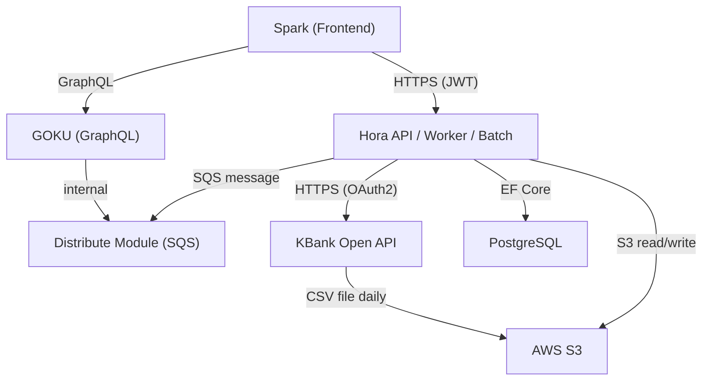

| System | Role | Integration |
|--------|------|-------------|
| **Hora API** | Fund transfer workflow — create request, approve, reject, transfer | REST (JWT auth) |
| **Hora Worker** | Poll KBank inquiry status, async business validate | Background service (lane-based) |
| **Hora Batch** | Daily reconciliation, reports | Scheduled job |
| **Spark** | Frontend — create request, worklist, track status | Nuxt.js, calls Hora API + GOKU |
| **GOKU** | Worklist listing + search (งานของฉัน, งานทั้งหมด) | GraphQL (existing, unchanged) |
| **Distribute** | Ticket assignment to Checker/Signer | SQS (existing, unchanged — processId 4/5, topicId 19/20) |
| **KBank Open API** | Account inquiry, fund transfer, status inquiry | HTTPS, OAuth2 client credentials |
| **S3** | Reconciliation files from KBank, document storage | AWS SDK |
| **PostgreSQL** | All transactional + config data | EF Core |

---

## S3. Domain Model

### Core Entities

```
FundTransferRequest 1──1 FundTransferTransaction 1──* FundTransferWorklist
        │                        │
        1──* RequestDetail       1──1 KBankTransaction 1──* KBankTransactionLog
        │
        1──* RequestDocument

TransferTopicConfig 1──* TopicFieldConfig
                    1──* TopicApprovalConfig
                    1──* TopicDocumentConfig
                    1──* DuplicateCheckConfig
```

| Entity | Purpose |
|--------|---------|
| **FundTransferRequest** | Core business data — company, accounts, amount, reference number, note |
| **FundTransferRequestDetail** | Row-based reference fields (reference1, reference2, reference3...) per topic config |
| **FundTransferRequestDocument** | Attached files (photo, PDF) with UUID filename on S3 |
| **FundTransferTransaction** | Workflow execution — status, hash, validation flags, 1:1 with request |
| **FundTransferWorklist** | Approval history — checker approve, signer approve, reject with remark |
| **KBankTransaction** | KBank-specific data — rsTransID, account name, final status, poll count |
| **KBankTransactionLog** | Audit log of each KBank API call (OAUTH, INQUIRY, TRANSFER only — not polling) |
| **KBankReconcileBatch** | Daily reconcile file metadata + summary counts |
| **KBankReconcileDetail** | Per-record reconcile result — matched/mismatched/unmatched |

### Config Entities (no auto-increment IDs)

| Entity | Purpose |
|--------|---------|
| **TransferTopicConfig** | Transfer categories (e.g., Lending, Payroll) |
| **TransferTopicFieldConfig** | Which reference fields each topic requires, with labels and searchability |
| **TransferTopicApprovalConfig** | Approval steps per topic (step 1=Checker role, step 2=Signer role) |
| **TransferTopicDocumentConfig** | Which document types are mandatory per topic |
| **DuplicateCheckConfig** | 13 configurable rules checking fund_transfer_request + detail for duplicates |
| **DocumentTypeConfig** | Allowed file types, max size per document category |
| **ProxyTypeConfig** | Proxy types — ACCOUNT, PROMPTPAY_MOBILE, PROMPTPAY_IDCARD |
| **BankCodeConfig** | Bank codes and names |
| **ReferenceTypeConfig** | Reference types — สัญญา, บัตรประชาชน, etc. |

### Black Box Structure — Partner Isolation

The core domain (`fund_transfer_*`) and the partner domain (`kbank_*`) are **separate black boxes**. The core system never reads KBank-specific columns; the KBank module never modifies core workflow status directly.

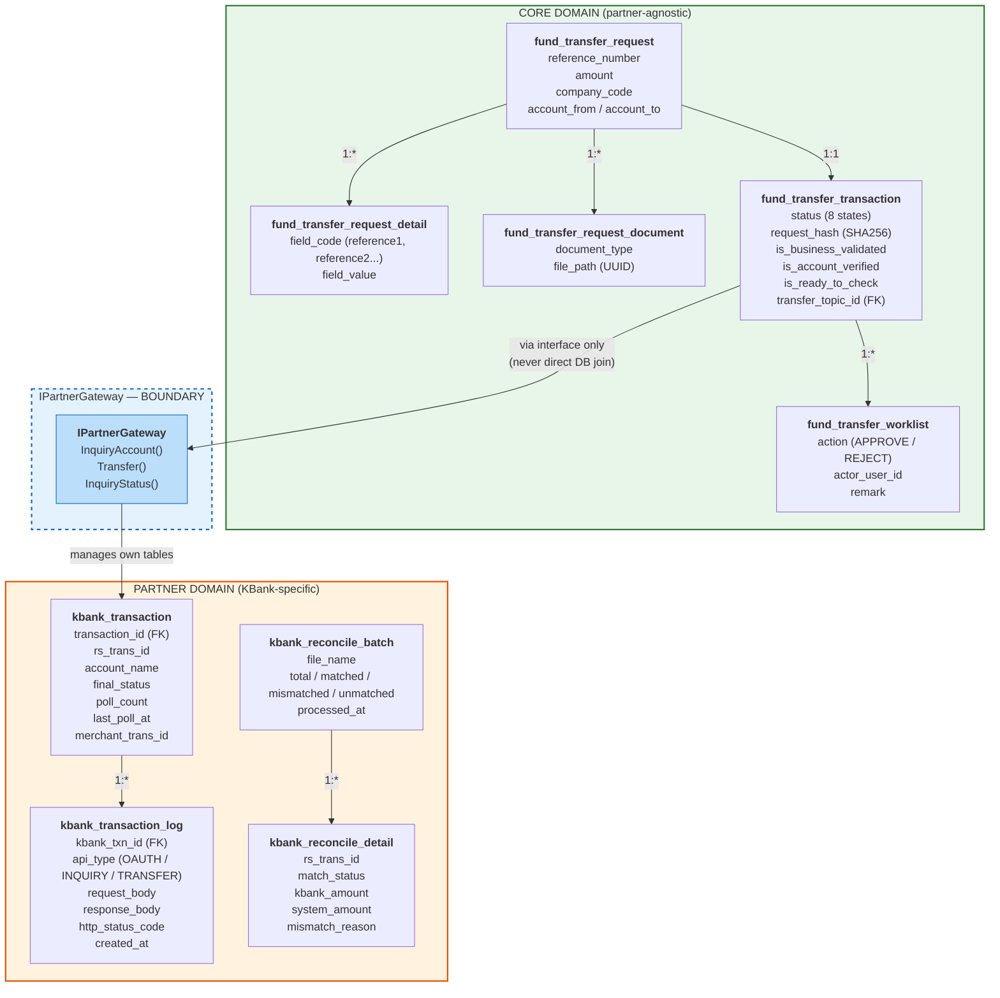

**How they connect — `IPartnerGateway` interface:**

```csharp
// Core domain calls this — does NOT know it's KBank
public interface IPartnerGateway
{
    Task<InquiryResult> InquiryAccount(InquiryAccountRequest request);
    Task<TransferResult> Transfer(TransferRequest request);
    Task<StatusResult> InquiryStatus(string partnerTransactionId);
}

// KBank implementation manages its own tables
public class KBankGateway : IPartnerGateway
{
    // Reads/writes kbank_transaction + kbank_transaction_log
    // Core domain never touches these tables directly
}

// Future partner — add new implementation + new partner tables
public class ScbGateway : IPartnerGateway { ... }
```

**Rules:**
1. Core domain → Partner domain: **only via `IPartnerGateway`** — no direct SQL join
2. Partner domain → Core domain: **only `fund_transfer_transaction.id`** as FK reference
3. `kbank_transaction_log` stores raw request/response **only for OAUTH, INQUIRY, TRANSFER** — NOT for INQUIRY_STATUS polling
4. `kbank_transaction.poll_count` + `last_poll_at` updated by Worker — no log entry
5. Reconcile tables are KBank-specific — future partners will have their own reconcile tables

### Key Design Decisions on Domain

- **1:1 request-to-transaction** — one request always produces one transaction
- **request_hash on transaction** — SHA256 of all business fields, partial unique index on active statuses (not COMPLETED/REJECTED/CANCELLED) for double-click protection
- **Separate kbank_transaction table** — partner-specific data isolated from core transaction, enabling future partners (e.g., `scb_transaction`) without schema changes
- **Config-driven validation** — all business rules (required fields, approval steps, documents, duplicate checks) stored in DB config tables, not hardcoded
- **No WAITING_EDIT state** — rejected tickets are terminal; user creates a new request

---

## S4. Workflow / State Machine

### States

| ID | State | Description | Actor |
|----|-------|-------------|-------|
| 1 | CREATED | Transaction created, async processing started | System |
| 2 | WAITING_CHECKER | Distributed to Checker, pending review | Checker |
| 3 | WAITING_SIGNER | Checker approved, distributed to Signer | Signer |
| 4 | WAITING_TRANSFER | Signer approved, executing transfer | System |
| 5 | WAITING_STATUS | Transfer sent to KBank, polling for result | Worker |
| 6 | COMPLETED | Transfer confirmed successful | Terminal |
| 7 | REJECTED | Checker or Signer rejected | Terminal |
| 8 | CANCELLED | Transfer failed at KBank | Terminal |

### Transitions

| ID | From | Action | To | Triggered By |
|----|------|--------|----|-------------|
| 1 | CREATED | distribute | WAITING_CHECKER | System (SQS) |
| 2 | WAITING_CHECKER | approve | WAITING_SIGNER | Checker (requires `is_ready_to_check=TRUE`) |
| 3 | WAITING_CHECKER | reject | REJECTED | Checker |
| 4 | WAITING_SIGNER | approve | WAITING_TRANSFER | Signer |
| 5 | WAITING_SIGNER | reject | REJECTED | Signer |
| 6 | WAITING_TRANSFER | transfer_sent | WAITING_STATUS | System (KBank Transfer API) |
| 7 | WAITING_STATUS | transfer_completed | COMPLETED | Worker (KBank Inquiry Status) |
| 8 | WAITING_STATUS | transfer_failed | CANCELLED | Worker (KBank Inquiry Status or max retry) |

### State Diagram

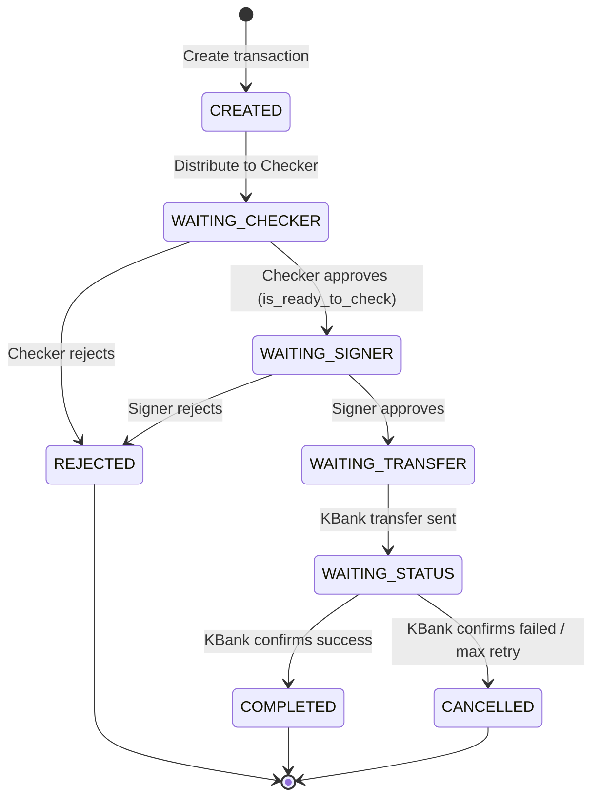

### Two Entry Flows

| Flow | Trigger | Behavior |
|------|---------|----------|
| **AUTO** | External system calls API with `auto=true` | Request + Transaction created together, immediately enters pipeline |
| **MANUAL** | Operation team via Spark UI with `auto=false` | Request created first (no transaction), transaction created after operation approves |

Both flows merge at CREATED and follow identical pipeline from that point.

---

## S5. Key Flows

### Flow 1: AUTO — Create Request & Transaction

**Trigger:** External system calls API with `auto=true`
**Systems:** External → Hora API → PostgreSQL → SQS (Distribute) → KBank Open API

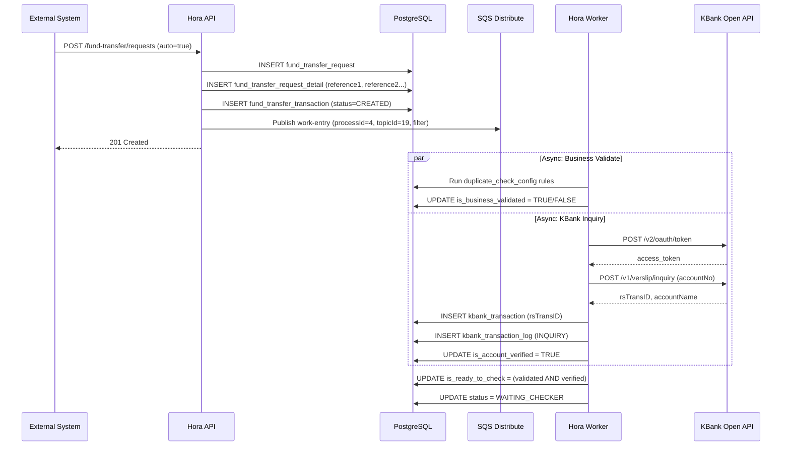

**Transaction boundaries:** Request + transaction + SQS publish = atomic (PG + outbox). Business validate and KBank inquiry = async (eventually consistent).
**Failure:** SQS publish fails → PG rolls back. KBank inquiry fails → `is_account_verified` stays FALSE, Checker sees ticket but cannot approve.

### Flow 2: MANUAL — Create Request Then Transaction

**Trigger:** Operation team creates request via Spark UI with `auto=false`
**Systems:** Spark → Hora API → PostgreSQL → SQS (Distribute) → KBank Open API

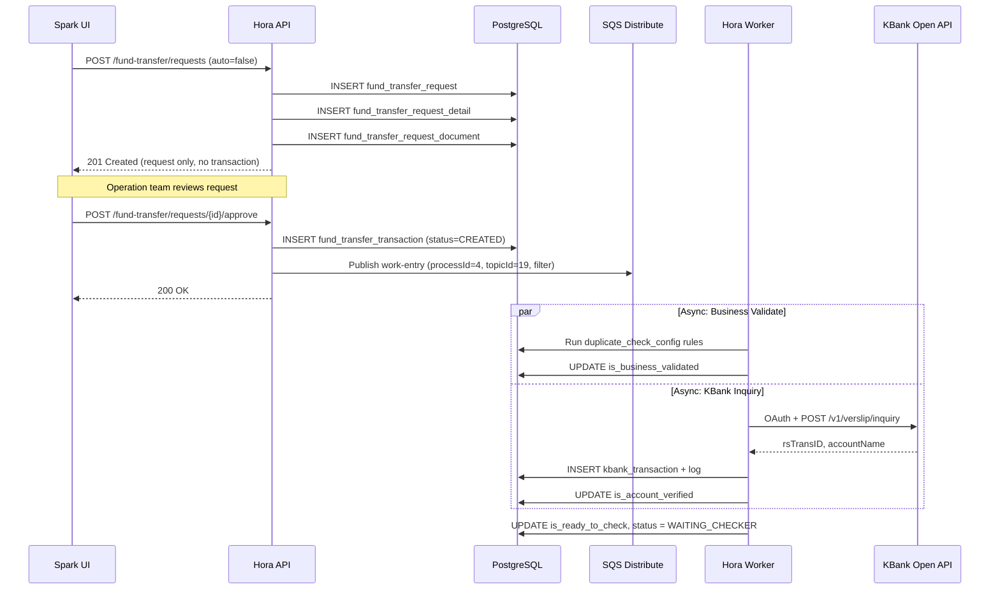

**Transaction boundaries:** Same as AUTO from transaction creation point.
**Failure:** Same as AUTO.

### Flow 3: Checker Approval

**Trigger:** Checker clicks approve in Spark
**Systems:** Spark → Hora API → PostgreSQL → SQS (Distribute)

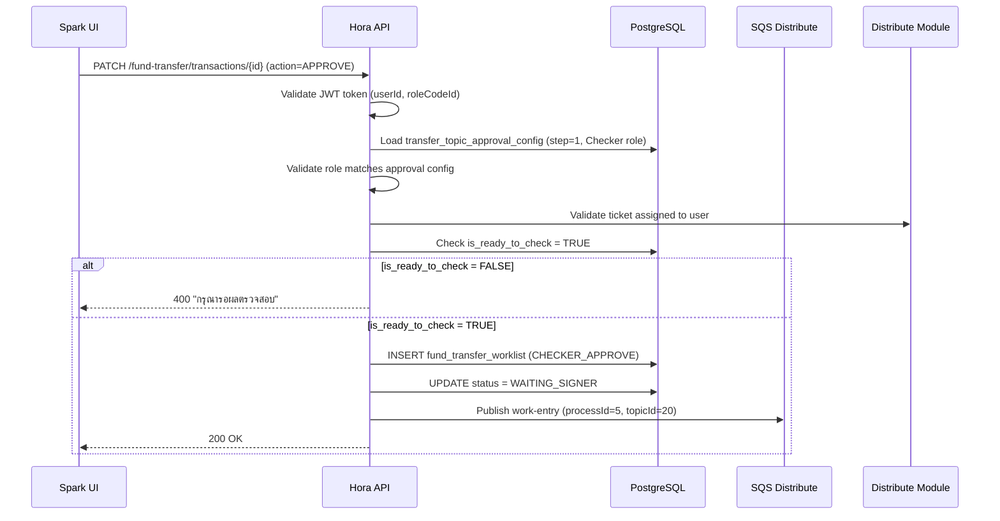

**Transaction boundaries:** Worklist insert + status update + SQS publish = atomic.
**Failure:** Any validation failure returns 4xx. SQS failure rolls back entire transaction.

### Flow 4: Signer Approval → KBank Transfer → Pub/Sub Notification

**Trigger:** Signer clicks approve in Spark
**Systems:** Spark → Hora API → PostgreSQL → KBank Open API → RabbitMQ (Pub/Sub) → Downstream Systems

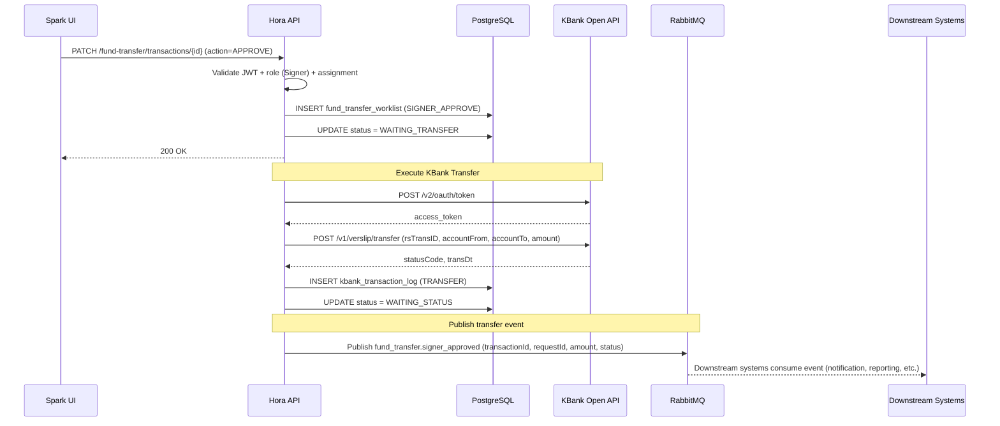

**Transaction boundaries:** Worklist insert + status update = atomic. KBank transfer = separate call. RabbitMQ publish = after KBank success.
**Failure:** If KBank transfer fails (HTTP error), status stays WAITING_TRANSFER for manual review. RabbitMQ publish failure does not affect transfer — eventually consistent.

### Flow 5: Worker — KBank Status Polling

**Trigger:** Worker scheduled interval (configurable, default 30s)
**Systems:** Hora Worker → KBank Open API → PostgreSQL → RabbitMQ

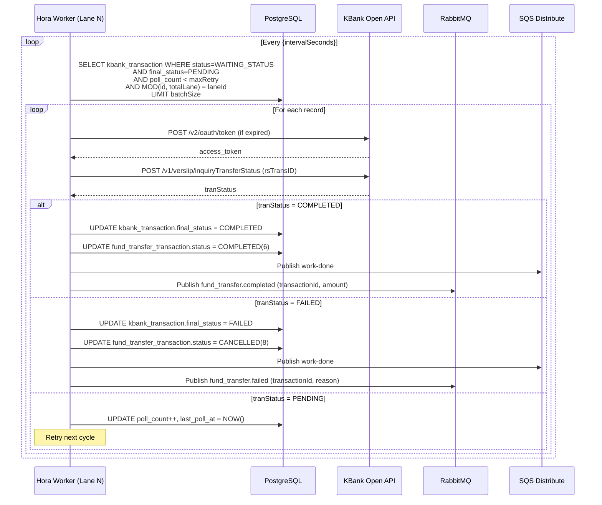

**Transaction boundaries:** Per-record update is atomic (PG transaction).
**Failure:** HTTP error → increment poll_count, retry next cycle. Max retry exceeded → mark FAILED → CANCELLED(8).
**No kbank_transaction_log** for polling — only updates main table.

### Flow 6: Worklist Filter (งานของฉัน / งานทั้งหมด)

**Trigger:** User opens worklist page in Spark
**Systems:** Spark → GOKU (GraphQL) → Distribute → Spark → Hora API

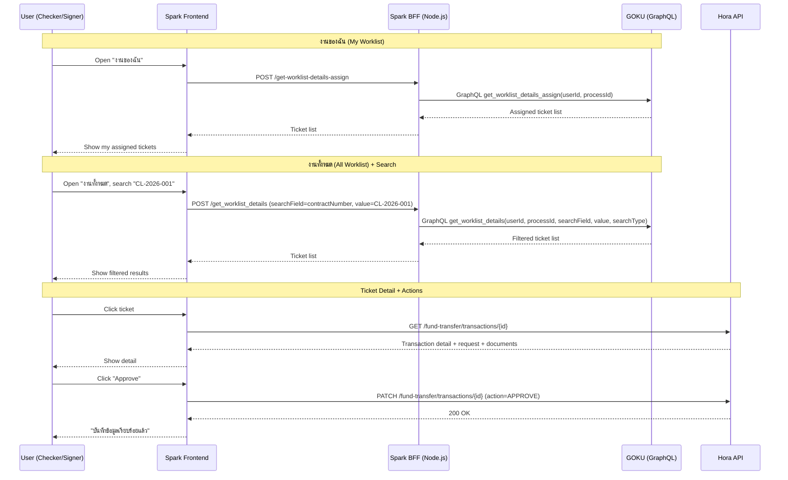

**Note:** GOKU and Distribute are existing systems — no modifications needed. Search fields mapped: `contractNumber` ← request.reference_number, `fullName` ← request_detail.reference1.

### Flow 7: Daily Reconciliation

**Trigger:** Scheduled batch job (07:00 AM daily)
**Systems:** AWS S3 → Hora Batch → PostgreSQL → Email/Google Chat

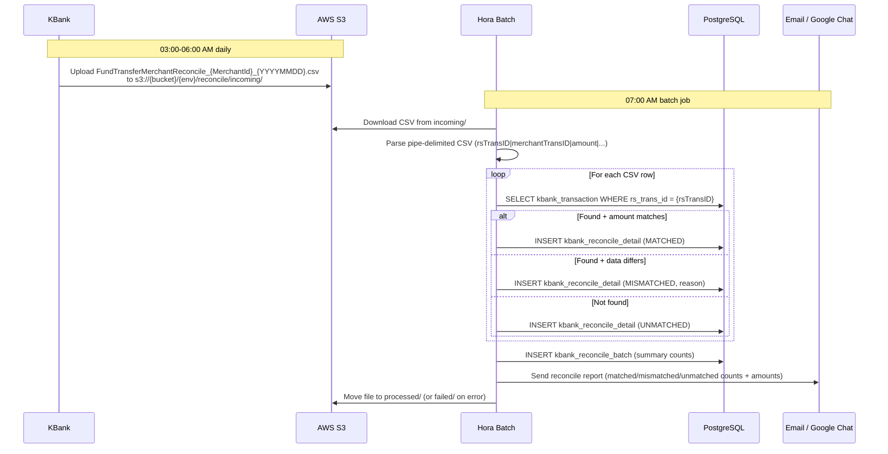

**Transaction boundaries:** Batch + detail inserts = atomic per file.
**Failure:** Parse error → file to `failed/`, notification with error. Missing file → log warning, no action.

---

## S6. API Contracts

### Hora API → KBank Open API

#### OAuth Token

| Field | Description |
|-------|-------------|
| Endpoint | `POST /v2/oauth/token` |
| Purpose | Obtain access token for KBank API calls |
| Auth | Basic (base64 consumer_key:consumer_secret) |
| Cache | 25 minutes (token expires at 30 min, max 5 requests per 30 min) |

#### Inquiry Account

| Field | Description |
|-------|-------------|
| Endpoint | `POST /v1/verslip/inquiry` |
| Purpose | Verify receiver account and obtain rsTransID for transfer |
| Auth | Bearer {access_token} |
| Key request | merchantId, partnerTxnUid (UUID), accountNo, accountType |
| Key response | statusCode, accountName, rsTransID |
| Error | statusCode != "0000" → mark `is_account_verified=FALSE` |

#### Fund Transfer

| Field | Description |
|-------|-------------|
| Endpoint | `POST /v1/verslip/transfer` |
| Purpose | Execute fund transfer using rsTransID from inquiry |
| Auth | Bearer {access_token} |
| Key request | rsTransID, accountFrom, accountTo, amount |
| Key response | statusCode, transDt |
| Error | statusCode != "0000" → status remains WAITING_TRANSFER for manual review |

#### Inquiry Transfer Status

| Field | Description |
|-------|-------------|
| Endpoint | `POST /v1/verslip/inquiryTransferStatus` |
| Purpose | Poll transfer result (Worker only) |
| Auth | Bearer {access_token} |
| Key request | rsTransID |
| Key response | statusCode, tranStatus (COMPLETED/PENDING/FAILED) |
| Error | HTTP error → increment poll_count, retry next cycle |

### Hora API → Distribute (SQS)

#### Work Entry Message

| Field | Description |
|-------|-------------|
| Direction | Hora → SQS → Distribute |
| Purpose | Assign ticket to Checker (processId=4) or Signer (processId=5) |
| Key fields | processId, topicId, referenceId (transaction.id), filter |
| Filter | `contractNumber` ← request.reference_number, `fullName` ← request_detail.reference1 |

### Hora API → RabbitMQ (Pub/Sub Events)

#### fund_transfer.signer_approved

| Field | Description |
|-------|-------------|
| Direction | Hora → RabbitMQ → Downstream consumers |
| Purpose | Notify downstream systems when Signer approves and transfer begins |
| Key fields | transactionId, requestId, amount, transferTopicCode, status |
| Consumers | Notification service, reporting, audit log |

#### fund_transfer.completed

| Field | Description |
|-------|-------------|
| Direction | Hora Worker → RabbitMQ → Downstream consumers |
| Purpose | Notify downstream systems when KBank confirms transfer success |
| Key fields | transactionId, requestId, amount, completedAt |

#### fund_transfer.failed

| Field | Description |
|-------|-------------|
| Direction | Hora Worker → RabbitMQ → Downstream consumers |
| Purpose | Notify downstream systems when KBank confirms transfer failed |
| Key fields | transactionId, requestId, amount, failureReason |

### Spark → GOKU (GraphQL)

| Field | Description |
|-------|-------------|
| Endpoint | `POST /gql-money-management` |
| Purpose | Worklist listing and search (งานของฉัน, งานทั้งหมด) |
| Direction | Spark BFF → GOKU |
| Key params | userId, processId, searchField (contractNumber/fullName), value, searchType |
| Unchanged from | Current system — no modifications needed |

---

## S7. Side Effect Map

| Trigger | DB Changes | Messages Published | Callbacks | Notes |
|---------|-----------|-------------------|-----------|-------|
| Create request (AUTO) | PG: insert request + detail + document + transaction (CREATED) | SQS: work-entry (processId=4) | — | API transaction. Async: business validate + KBank inquiry |
| Create request (MANUAL) | PG: insert request + detail + document only | — | — | No transaction yet |
| Operation approve (MANUAL) | PG: insert transaction (CREATED) | SQS: work-entry (processId=4) | — | Same as AUTO from this point |
| Business validate complete | PG: update `is_business_validated`, check `is_ready_to_check` | — | — | Async worker |
| KBank inquiry complete | PG: insert kbank_transaction + log, update `is_account_verified`, check `is_ready_to_check` | — | — | Async worker |
| Checker approve | PG: insert worklist (CHECKER_APPROVE), status → WAITING_SIGNER | SQS: work-entry (processId=5) | — | API transaction |
| Checker reject | PG: insert worklist (REJECT), status → REJECTED | SQS: work-done | — | API transaction |
| Signer approve | PG: insert worklist (SIGNER_APPROVE), status → WAITING_TRANSFER | RabbitMQ: fund_transfer.signer_approved | — | API transaction. Then: KBank Transfer |
| Signer reject | PG: insert worklist (REJECT), status → REJECTED | SQS: work-done | — | API transaction |
| KBank transfer sent | PG: insert kbank_transaction_log (TRANSFER), status → WAITING_STATUS | — | — | API transaction |
| Worker: status COMPLETED | PG: update kbank_transaction.final_status, status → COMPLETED | SQS: work-done, RabbitMQ: fund_transfer.completed | — | Worker transaction |
| Worker: status FAILED | PG: update kbank_transaction.final_status, status → CANCELLED | SQS: work-done, RabbitMQ: fund_transfer.failed | — | Worker transaction |
| Batch: reconcile | PG: insert reconcile_batch + detail | — | Email + Google Chat | Batch job |

---

## S8. Architecture Decisions

| # | Decision | Options Considered | Chosen | Rationale |
|---|----------|-------------------|--------|-----------|
| 1 | Monorepo structure | (a) Keep 4 repos (b) Merge into Hora.sln monorepo | **(b) Monorepo** | Follows Bookkeeping pattern, shared code via Hora.Core/Partner/Infra, single CI pipeline |
| 2 | Partner abstraction | (a) Direct KBank calls throughout code (b) IPartnerGateway interface | **(b) Interface** | Future partners (SCB, BBL) can implement same interface; kbank_transaction table isolated |
| 3 | Partner config storage | (a) partner_config DB table (b) appsettings.json per environment | **(b) appsettings** | Over-engineering to put in DB for now; credentials belong in config, not DB |
| 4 | Worklist listing source | (a) Hora owns listing + search (b) Keep GOKU/Distribute (existing) | **(b) Keep existing** | GOKU + Distribute already work; no need to rebuild listing infrastructure |
| 5 | Distribute search fields | (a) Use worklist_index_detail (35 types) (b) Map 2 fields to WorkEntryFilter | **(b) Two fields** | `contractNumber` from reference_number, `fullName` from request_detail.reference1 — sufficient for fund transfer search |
| 6 | Inquiry Status polling | (a) Batch job (b) Worker with lane-based MOD partitioning | **(b) Worker + lane** | Real-time polling with configurable interval; MOD(id, totalLane) = no lock, no overlap, scale by adding instances |
| 7 | Inquiry Status logging | (a) Log every poll to kbank_transaction_log (b) No log for polling | **(b) No log** | Polling is high-frequency, low-value for audit; update kbank_transaction.poll_count + last_poll_at instead |
| 8 | WAITING_EDIT state | (a) Allow rework loop (b) Rejected = terminal, create new request | **(b) Terminal** | Simplifies workflow; avoids state complexity and audit confusion |
| 9 | Duplicate check approach | (a) Hardcoded rules (b) Config-driven duplicate_check_config | **(b) Config-driven** | 13 rules checking request + detail tables; soft warning (is_business_validated) — Checker reviews, not blocked |
| 10 | request_hash location | (a) On fund_transfer_request (b) On fund_transfer_transaction | **(b) Transaction** | MANUAL flow allows intentional duplicate requests; hash blocks double-click at execution level with partial unique index on active statuses |
| 11 | .NET version | (a) Keep .NET Core 3.1 (b) Upgrade to .NET 10 | **(b) .NET 10** | New project — per policy. Not upgrading existing 3.1 projects |
| 12 | Event communication | (a) Sync API callbacks (b) RabbitMQ pub/sub for transfer events | **(b) RabbitMQ** | Follows team async communication pattern; decouples Hora from downstream consumers |

---

## S9. Error Handling, Resilience & Observability

### Failure Scenarios

| Failure Scenario | System | Expected Behavior | Recovery |
|-----------------|--------|-------------------|----------|
| KBank OAuth token expired | API/Worker | Refresh token, retry API call | Automatic (cache invalidation) |
| KBank Inquiry fails (HTTP error) | API | `is_account_verified` stays FALSE, ticket visible but Checker cannot approve | Async retry; manual re-trigger if persistent |
| KBank Transfer fails (HTTP error) | API | Status stays WAITING_TRANSFER | Manual review + retry via admin endpoint |
| KBank Inquiry Status timeout | Worker | Increment poll_count, retry next cycle | Automatic until maxRetry |
| KBank Inquiry Status max retry exceeded | Worker | Mark FAILED → status=CANCELLED | Manual investigation via reconcile |
| SQS Distribute publish fails | API | Entire PG transaction rolls back | Client retries the action |
| RabbitMQ publish fails | API/Worker | Transfer proceeds; event published on retry | Eventually consistent — does not block transfer |
| Duplicate request_hash | API | PG unique constraint violation → 409 Conflict | By design — prevents double-click |
| Reconcile file missing in S3 | Batch | Log warning, no action | KBank re-sends or manual upload |
| Reconcile parse error | Batch | File moves to `failed/`, notification sent | Fix file and re-run batch |

### Observability

**Metrics:**
- KBank API latency (p50, p95 per endpoint)
- Worker poll success/failure rate per lane
- Queue depth for distribute-event-queue
- Transaction state transition latency
- Reconcile match rate (matched / total)
- RabbitMQ publish success/failure rate

**Structured logging fields:**
- `transactionId`, `requestId`, `referenceNumber`, `transactionCode`
- `kbankRsTransId` (cross-system tracing with KBank)
- `workflowAction`, `fromState`, `toState`
- `workerLaneId`, `pollCount`

**Alerts:**
- KBank API error rate > 5% for 5 minutes
- Worker poll_count approaching maxRetry (> 80%)
- Reconcile mismatch count > 0
- Distribute queue depth > 100 for > 10 minutes
- RabbitMQ dead-letter queue depth > 0

---

## S10. Non-Functional Requirements

| Aspect | Requirement | Rationale |
|--------|------------|-----------|
| API latency | Approve/reject < 500ms | User-facing action |
| KBank Inquiry | < 5s per call | Acceptable for async verification |
| Worker polling interval | Configurable 30s default | Balance between speed and KBank rate limits |
| Worker lane scaling | 1-5 instances via appsettings | No code change needed to scale |
| Reconcile processing | < 5 minutes for 1000 records | Daily batch window |
| Data retention | Transaction + audit data: 7 years | Banking compliance |
| File upload | Max 10MB per file, JPG/PNG/PDF only | Security + storage cost |
| OAuth token cache | 25 minutes (max 5 requests per 30 min) | KBank rate limit constraint |
| RabbitMQ delivery | At-least-once with idempotent consumers | No lost events |

---

## S11. Feature Decomposition

| # | Feature | Scope | Architecture Constraints | Delegated Decisions |
|---|---------|-------|------------------------|-------------------|
| F1 | Fund Transfer Request CRUD | Create/read request with detail + documents, config-driven validation | Must validate against `transfer_topic_field_config` and `transfer_topic_document_config`. File upload must use magic number detection + UUID filename. | Validation error message format, UI form layout |
| F2 | Fund Transfer Transaction Pipeline | Create transaction, async distribute + validate + inquiry, state transitions | Must follow 8-state machine. `is_ready_to_check` = `is_business_validated AND is_account_verified`. Distribute SQS message must include `filter.contractNumber` and `filter.fullName`. | Internal retry strategy for async tasks, error logging detail |
| F3 | Checker/Signer Approval | Approve/reject with role + ownership validation | Must validate role against `transfer_topic_approval_config`. Must check ticket assignment via Distribute. Must check `is_ready_to_check=TRUE` before Checker approve. Signer approve must publish RabbitMQ event. | UI approval dialog, remark field requirements |
| F4 | KBank Gateway | OAuth, Inquiry, Transfer, InquiryStatus via `IPartnerGateway` | Must log OAUTH/INQUIRY/TRANSFER to `kbank_transaction_log`. Must NOT log INQUIRY_STATUS. Token cache 25 min. Mask credentials in logs. | HTTP client configuration, retry backoff strategy |
| F5 | Inquiry Status Worker | Poll KBank for transfer results | Must use MOD(id, totalLane) lane partitioning. Must respect maxRetry from appsettings. Must update `poll_count` + `last_poll_at`. Must publish RabbitMQ events on COMPLETED/FAILED. | Worker health check, graceful shutdown strategy |
| F6 | Reconciliation Batch | Download CSV from S3, match, report, notify | Must match by `rsTransID`. Must categorize MATCHED/MISMATCHED/UNMATCHED. Must move file to processed/failed. | Report format, notification template |
| F7 | Duplicate Check | Config-driven duplicate detection across 13 rules | Must use `duplicate_check_config` rules. Result stored in `is_business_validated`. Soft warning only — does not block. | Duplicate warning UI display |
| F8 | Spark Frontend Updates | Worklist pages, create request form, approval UI | Must use POST for search with sensitive data. Must not expose internal IDs. Must disable source maps in production. Must remove /get-env endpoint. | Component structure, state management |
| F9 | Security Hardening | Auth middleware, security headers, CORS, input validation | Must follow Section S13 (Security) requirements. All pentest findings must be addressed. | Specific validation regex patterns, error message wording |

---

## S12. Development Phases

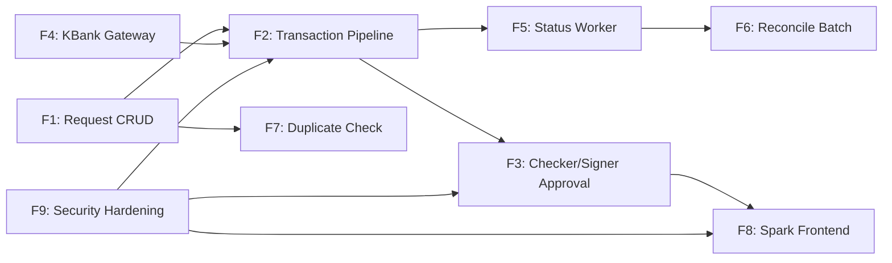

---

## S13. Security — Pentest Compliance & Guidelines

> Based on findings from Mayaseven and ITSL security audits on the LOS system. All issues must be addressed in H2H to pass pentest.

### 13.1 Authentication & Authorization (Critical)

**Pentest ref:** #2 Mayaseven (CVSS 9.3), #1.2 ITSL (CVSS 9.4)

**Constraint:** Every H2H API endpoint MUST require a valid JWT/Bearer token. No anonymous access. No header-based role manipulation.

**Middleware pipeline:**
```
Request → AuthMiddleware (JWT validation)
        → RoleMiddleware (role from token, check against approval config)
        → Controller
```

- Extract `userId` and `roleCodeId` from JWT token — never from HTTP headers
- Validate role against `transfer_topic_approval_config` for approve/reject actions
- Verify ticket assignment via Distribute for ownership check (IDOR prevention — ref #5 Mayaseven)

### 13.2 SQL Injection Prevention (Critical)

**Pentest ref:** #1 Mayaseven (CVSS 9.3), #1.1 ITSL (CVSS 9.4)

**Constraint:** All database queries MUST use EF Core parameterized queries or parameterized raw SQL. Zero tolerance for string concatenation in SQL. All user input must be whitelist-validated (regex pattern + max length).

### 13.3 Input Validation — Server Side (High)

**Pentest ref:** #1.6 ITSL (CVSS 8.2), #1.7 ITSL (CVSS 6.9)

**Constraint:** All business data MUST be validated server-side regardless of client-side validation.

- Amount: positive, within range, no manipulation after submission
- Transfer date: no backdating
- Required fields: from `transfer_topic_field_config` (config-driven)
- Required documents: from `transfer_topic_document_config` (config-driven)
- File uploads: validate by magic number (not extension), whitelist types, max size, UUID filenames (ref #1.5 ITSL)

### 13.4 Session Management (High)

**Pentest ref:** #1.3 ITSL (CVSS 8.7), #1.4 ITSL (CVSS 8.7)

**Constraint:** Server-side JWT generation. No Base64-encoded credentials as tokens. Session timeout (60 min). Terminate on logout. Invalidate when user disabled.

### 13.5 Data Protection (Medium)

**Pentest ref:** #7 Mayaseven (CVSS 5.3), #1.12 ITSL (CVSS 5.9), #1.14 ITSL (CVSS 5.9)

**Constraints:**
- **Search:** POST method only for queries containing sensitive data (reference_number, name, idCard)
- **Response:** Map to DTOs — never return full entities. No password hashes, no internal system fields
- **Errors:** Generic user-facing messages. No stack traces, no SQL errors, no server info (ref #12 Mayaseven, #1.19 ITSL)
- **Credentials:** KBank keys in appsettings (production: AWS Secrets Manager). Mask in log bodies

### 13.6 HTTP Security Headers (Low-Medium)

**Pentest ref:** #13, #15 Mayaseven, #2.5, #2.6, #2.7, #2.8 ITSL

**Constraint:** All Hora API responses must include:
- `X-Content-Type-Options: nosniff`
- `X-Frame-Options: SAMEORIGIN`
- `X-XSS-Protection: 1; mode=block`
- `Strict-Transport-Security: max-age=63072000; includeSubDomains`
- `Cache-Control: no-cache, no-store, must-revalidate`
- `Content-Security-Policy: default-src 'self'`
- Remove: `X-Powered-By`, `Server`

### 13.7 CORS (Low)

**Pentest ref:** #16 Mayaseven (CVSS 2.9), #2.2 ITSL (CVSS 4.1)

**Constraint:** Whitelist specific domains only. No wildcard `Access-Control-Allow-Origin: *`.

### 13.8 Spark Frontend Security (Medium)

**Pentest ref:** #4, #8, #9, #10 Mayaseven, #1.16 ITSL

**Constraints:**
- Disable source maps in production build
- Remove `/get-env` endpoint in production
- No hard-coded credentials in source code
- No sensitive data in localStorage — clear on logout
- Cookie flags: `Secure; HttpOnly; SameSite=Strict`
- HTTPS only
- Proper 404 page (no redirect loops)

### 13.9 Security Checklist (for pentest readiness)

| Priority | Category | Constraint | Pentest Ref |
|----------|----------|-----------|-------------|
| Critical | Auth | JWT on all endpoints, no anonymous | #2, #1.2 |
| Critical | SQLi | Parameterized queries only | #1, #1.1 |
| Critical | IDOR | Ownership check on all ID-based access | #5 |
| High | Session | Server-side JWT, timeout, logout invalidation | #1.3, #1.4 |
| High | File Upload | Magic number validation, UUID filename, S3 storage | #1.5 |
| High | Business Logic | Server-side validation for amount, date, required fields | #1.6, #1.7 |
| Medium | Search | POST method for sensitive data queries | #7, #1.14 |
| Medium | Response | DTO mapping, minimal fields, no sensitive data | #1.12 |
| Medium | Errors | Generic messages, log details server-side only | #12, #1.19 |
| Medium | Credentials | appsettings / Secrets Manager, mask in logs | #4 |
| Medium | CORS | Whitelist domains only | #16, #2.2 |
| Low | Headers | All OWASP security headers | #13, #15, #2.6 |
| Low | HTTPS | TLS 1.2+ only | #6, #2.1, #2.3 |
| Low | Frontend | No source maps, no /get-env, no localStorage secrets | #8, #9, #1.16 |
| Low | Cookies | Secure, HttpOnly, SameSite=Strict | #2.8 |
