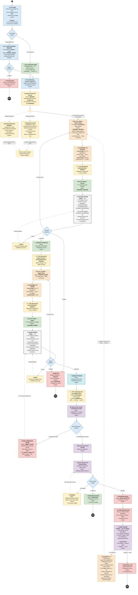

this is overview concept of fund transfer system

```mermaid 
flowchart TD
    %% ================================================================
    %% PHASE 0 — FUND TRANSFER REQUEST (FTR) — Display #1
    %% ================================================================

    START(("●")) --> FTR_CREATE["📝 <b>FTR Created</b><br/>• From Source System via API<br/>• OR manually on D1 by Maker<br/>  — Single entry or Batch upload<br/><br/><b>Contains:</b><br/>① Fund Transfer Detail<br/>② Documents / Evidence"]

    FTR_CREATE --> FTR_MODE{"Processing<br/>Mode?"}

    FTR_MODE -- "🤖 Auto-Approve" --> AUTO_APPROVE["🤖 <b>AUTO-APPROVE MODE</b><br/>Integration point — no Maker decision<br/>FTR auto-approved immediately → Create FTT"]

    FTR_MODE -- "👤 Manual Approve" --> D1_FTR["📺 <b>D1: FUND TRANSFER REQUEST</b><br/>FTR appears for <b>Maker</b> to review<br/>Status: <b>PENDING_MAKER</b><br/>• Fund Transfer Details<br/>• Attached Documents / Evidence"]

    D1_FTR --> MAKER_DEC{"Maker<br/>Decision"}

    MAKER_DEC -- "🚫 Reject" --> FTR_REJECTED["🚫 <b>FTR REJECTED</b><br/>Status: FTR_REJECTED<br/>📨 Published to Source System"]
    FTR_REJECTED --> END_FTR(("END"))

    MAKER_DEC -- "✅ Approve" --> FTR_APPROVED
    AUTO_APPROVE --> FTR_APPROVED

    FTR_APPROVED["✅ <b>FTR APPROVED → System Creates FTT</b><br/>Status: FTR_APPROVED | 📨 Published to Source System"]

    %% ================================================================
    %% PHASE 1 — FTT CREATION + BACKGROUND CHECKS | 🔔 TP1
    %% ================================================================

    FTR_APPROVED --> FTT_CREATED["⚙️ <b>System Creates FTT Record</b><br/>Status: <b>CREATED</b><br/>Triggers parallel checks in <b>background</b><br/>FTT proceeds to All Tasks D2 <b>immediately</b>"]

    FTT_CREATED --> FORK1{"+"}

    FORK1 -. "Background Async" .-> INQ_CHECK["🔍 <b>(1) Inquiry Account</b><br/>⚡ Background / Async<br/>Call H2H Bank Provider API<br/>Validate destination bank account<br/>→ PASS / NOT PASS / ERROR<br/><i>Returns: Verification Ref Key</i>"]

    FORK1 -. "Background Async" .-> INT_CHECK["🔍 <b>(2) Internal Business Validation</b><br/>⚡ Background / Async<br/>Check duplicate transaction<br/>Check suspicious transaction<br/>→ PASS / NOT PASS / ERROR"]

    FORK1 -- "▼ Main flow proceeds immediately" --> D2_CHECKER

    INQ_CHECK -. "Results update D2/D3 async" .-> ASYNC_NOTE["⚡ Results update displays<br/>asynchronously when checks complete"]
    INT_CHECK -. "Results update D2/D3 async" .-> ASYNC_NOTE

    %% ================================================================
    %% PHASE 2 — D2 ALL TASKS → CHECKER ASSIGNMENT | 🔔 TP2
    %% ================================================================

    D2_CHECKER["📺 <b>D2: ALL TASKS — Checker Phase</b><br/>FTT appears <b>immediately</b> after creation<br/>Status: <b>PENDING_CHECKER</b><br/>Shows recheck progress: ✅ Done / ⏳ In Progress / ❌ Error<br/>⚠️ No Retry here — Retry on D3 only"]

    D2_CHECKER --> ASSIGN_CHECKER["📋 <b>ASSIGNMENT TO CHECKER</b><br/>🤖 <b>Auto Assign:</b> ALL FTT regardless of<br/>recheck status — max 2 per Checker<br/>👤 <b>Manual Book:</b> Checker books any FTT — no limit"]

    ASSIGN_CHECKER --> RECHECK_C["⚙️ <b>🔔 TP2: Recheck (2) Internal Business Validation</b><br/><i>Triggered on assignment — Auto or Manual</i>"]

    RECHECK_C --> D3_CHECKER["📺 <b>D3: MY TASKS — Checker</b><br/>FTT assigned to this Checker<br/>Status: <b>ASSIGNED_CHECKER</b>"]

    %% ================================================================
    %% PHASE 3 — CHECKER REVIEW (D3 MY TASKS) | 🔔 TP3, TP4
    %% ================================================================

    D3_CHECKER --> PANEL_CHECKER["📋 <b>CHECKER REVIEW PANEL</b> — D3<br/>📝 FTT Details: Txn ID, Amount, Accounts, Beneficiary<br/>🔍 Checking Results:<br/>  • (1) Inquiry Account: PASS/NOT PASS/ERROR/⏳<br/>  • (2) Internal Validation: PASS/NOT PASS/ERROR/⏳<br/>📎 Attached Documents from FTR<br/>⚠️ Previous Bank Result if re-submitted"]

    PANEL_CHECKER --> DEC_CHECKER{"Checker<br/>Decision"}

    DEC_CHECKER -- "🔁 Retry" --> RETRY_CHECKER["🔁 <b>RETRY</b><br/>Recheck incomplete steps<br/><i>Available on D3 only</i>"]
    RETRY_CHECKER -. "Results updated" .-> PANEL_CHECKER

    DEC_CHECKER -- "↩️ Return to D2" --> D2_CHECKER

    DEC_CHECKER -- "🚫 Reject" --> REJECTED

    DEC_CHECKER -- "✅ Approve" --> CHECKER_APPROVED["✅ <b>CHECKER APPROVED</b><br/>Status: CHECKER_APPROVED<br/>📨 Published to Source System"]

    CHECKER_APPROVED --> TP4_RECHECK["⚙️ <b>🔔 TP4: Recheck (1) Inquiry Account +<br/>(2) Internal Business Validation</b><br/><i>Before moving FTT to Signer All Tasks</i>"]

    %% ================================================================
    %% PHASE 4 — D2 ALL TASKS → SIGNER ASSIGNMENT | 🔔 TP5
    %% ================================================================

    TP4_RECHECK --> D2_SIGNER["📺 <b>D2: ALL TASKS — Signer Phase</b><br/>Status: <b>PENDING_SIGNER</b><br/>⚠️ No Retry here — Retry on D3 only"]

    D2_SIGNER --> ASSIGN_SIGNER["📋 <b>ASSIGNMENT TO SIGNER</b><br/>🤖 <b>Auto Assign:</b> ALL FTT regardless of<br/>recheck status — max 2 per Signer<br/>👤 <b>Manual Book:</b> no limit"]

    ASSIGN_SIGNER --> RECHECK_S["⚙️ <b>🔔 TP5: Recheck (2) Internal Business Validation</b><br/><i>Triggered on assignment — Auto or Manual</i>"]

    RECHECK_S --> D3_SIGNER["📺 <b>D3: MY TASKS — Signer</b><br/>FTT assigned to this Signer<br/>Status: <b>ASSIGNED_SIGNER</b>"]

    %% ================================================================
    %% PHASE 5 — SIGNER REVIEW (D3 MY TASKS) | 🔔 TP6, TP7
    %% ================================================================

    D3_SIGNER --> PANEL_SIGNER["📋 <b>SIGNER REVIEW PANEL</b> — D3<br/>📝 FTT Details & Checker Decision<br/>🔍 Checking Results: (1) & (2)<br/>📎 Attached Documents<br/>⚠️ Previous Bank Result if re-submitted<br/>🚨 Bank Submission Failure if applicable<br/><i>→ Approve again to retry submission</i>"]

    PANEL_SIGNER --> DEC_SIGNER{"Signer<br/>Decision"}

    DEC_SIGNER -- "🔁 Retry" --> RETRY_SIGNER["🔁 <b>RETRY</b><br/>Recheck incomplete steps<br/><i>Available on D3 only</i>"]
    RETRY_SIGNER -. "Results updated" .-> PANEL_SIGNER

    DEC_SIGNER -- "↩️ Return to D2" --> D2_SIGNER

    DEC_SIGNER -- "🚫 Reject" --> REJECTED

    DEC_SIGNER -- "✅ Approve" --> SIGNER_APPROVED["✅ <b>SIGNER APPROVED</b><br/>Status: SIGNER_APPROVED<br/>📨 Published to Source System"]

    SIGNER_APPROVED --> TP7_CHECK["⚙️ <b>🔔 TP7: Verification Ref Key Validity Check</b><br/>If ref key <b>NOT expired</b>: Submit directly<br/>If ref key <b>EXPIRED</b>: Re-verify → new key → submit"]

    %% ================================================================
    %% PHASE 6 — BANK SUBMISSION + RESULT + RE-SUBMIT / REJECT
    %% ================================================================

    TP7_CHECK --> SUBMIT_BANK["📤 <b>Submit Fund Transfer to H2H Bank Provider</b><br/>Status: SUBMITTED_TO_BANK<br/>📨 Published to Source System"]

    SUBMIT_BANK --> SUBMIT_CONFIRM{"Bank Submission<br/>Confirm?"}

    SUBMIT_CONFIRM -- "❌ Submission FAIL" --> SUBMIT_FAILED["❌ <b>BANK SUBMISSION FAILED</b><br/>Status: <b>SUBMIT_FAILED</b><br/>Bank did NOT create the transfer<br/>Show failure reason to Signer<br/>FTT <b>remains on Signer D3</b><br/>Approve again = retry submission"]
    SUBMIT_FAILED -. "🔁 FTT stays on Signer D3" .-> PANEL_SIGNER

    SUBMIT_CONFIRM -- "✅ Submission SUCCESS" --> BANK_PROC["🏦 <b>Bank Processes Fund Transfer</b><br/>Transfer to destination account"]

    BANK_PROC --> INQUIRY_RESULT["🔍 <b>System Inquires FTT Transfer Result</b><br/>Call Bank Provider API after interval<br/>Status: PENDING_BANK_RESULT"]

    INQUIRY_RESULT --> BANK_RESULT{"Bank Transfer<br/>Result?"}

    BANK_RESULT -- "⏳ Pending" --> PENDING["⏳ <b>PENDING</b><br/>Status: PENDING_BANK_RESULT<br/>System will re-inquiry after interval<br/>👤 User Action: NONE"]
    PENDING -. "Re-inquiry after interval" .-> INQUIRY_RESULT

    BANK_RESULT -- "✅ Success" --> SUCCESS["✅ <b>TRANSFER SUCCESS</b><br/>Status: <b>COMPLETED</b><br/>📨 Published to Source System<br/>👤 User Action: NONE"]
    SUCCESS --> END_SUCCESS(("END"))

    BANK_RESULT -- "❌ Failed" --> FAILED["❌ <b>TRANSFER FAILED</b><br/>Status: <b>BANK_REJECTED</b><br/>📨 Published to Source System"]

    FAILED --> NOTIFICATION["🔔 <b>SYSTEM NOTIFICATION</b><br/>«There is a failed transfer from bank»<br/>Sent to: Maker / Checker / Signer<br/>→ User goes to D4 to review"]

    NOTIFICATION --> FAILED_DETAIL["📋 <b>BANK FAILURE DETAIL — D4: FTT Status</b><br/>🏦 Bank Result Code & Description<br/>📜 FTT History: Created by / Checker / Signer / when<br/>📝 FTT Details & 📎 Attached Documents<br/><br/><b>👤 User Actions:</b><br/>🔄 RE-SUBMIT ⭐ Good to Have<br/>🚫 REJECT — Final Decision"]

    FAILED_DETAIL -- "🔄 Re-submit ⭐" --> RESUBMIT["🔄 <b>RE-SUBMIT FTT</b> ⭐ Good to Have<br/>Status: RE_SUBMITTED<br/>📨 Published to Source System<br/>① Tag FTT with bank result code & reason<br/>② Re-trigger checks (1) + (2)<br/>③ Move to Checker All Tasks D2<br/>④ Same process as new submission<br/><i>Bank result visible to Checker & Signer</i>"]
    RESUBMIT -. "🔄 Back to Checker All Tasks — Phase 2" .-> D2_CHECKER

    FAILED_DETAIL -- "🚫 Reject — Final" --> REJECT_D4["🚫 <b>REJECTED on D4</b><br/>Status: REJECTED<br/>📨 Published to Source System<br/><i>FTT lifecycle ends</i>"]
    REJECT_D4 --> END_REJECT_D4(("END"))

    %% ================================================================
    %% SHARED REJECTED NODE (Checker / Signer)
    %% ================================================================

    REJECTED["🚫 <b>REJECTED</b><br/>Reason Dropdown — <b>Required</b><br/>Free Text Remark — Optional<br/>Status: <b>REJECTED</b><br/>📨 Published to Source System"]
    REJECTED --> END_REJECTED(("END"))

    %% ================================================================
    %% STYLES
    %% ================================================================

    classDef startEnd fill:#333,stroke:#333,color:#fff,font-weight:bold
    classDef bluePhase fill:#DAEAF6,stroke:#5B9BD5,stroke-width:2px,color:#000
    classDef orangePhase fill:#FCE5CD,stroke:#D6B656,stroke-width:2px,color:#000
    classDef greenPhase fill:#D5E8D4,stroke:#82B366,stroke-width:2px,color:#000
    classDef tealPhase fill:#D1ECF1,stroke:#17A2B8,stroke-width:2px,color:#000
    classDef purplePhase fill:#E1D5E7,stroke:#9673A6,stroke-width:2px,color:#000
    classDef redNode fill:#F8CECC,stroke:#B85450,stroke-width:2px,color:#000
    classDef yellowNode fill:#FFF2CC,stroke:#D6B656,stroke-width:2px,color:#000
    classDef grayPanel fill:#F5F5F5,stroke:#333,stroke-width:2px,color:#000
    classDef asyncNote fill:#FFF2CC,stroke:#D6B656,stroke-width:1px,stroke-dasharray:5 5,color:#000

    class START,END_FTR,END_SUCCESS,END_REJECTED,END_REJECT_D4 startEnd
    class FTR_CREATE,D1_FTR,FTR_APPROVED bluePhase
    class AUTO_APPROVE,CHECKER_APPROVED greenPhase
    class FTR_REJECTED,REJECTED,FAILED,SUBMIT_FAILED,REJECT_D4,NOTIFICATION redNode
    class D2_CHECKER,ASSIGN_CHECKER,D2_SIGNER,ASSIGN_SIGNER,RESUBMIT orangePhase
    class D3_CHECKER,D3_SIGNER greenPhase
    class PANEL_CHECKER,PANEL_SIGNER grayPanel
    class FTT_CREATED,RECHECK_C,RECHECK_S,TP4_RECHECK,TP7_CHECK yellowNode
    class INQ_CHECK,INT_CHECK,RETRY_CHECKER,RETRY_SIGNER,PENDING yellowNode
    class FORK1,ASYNC_NOTE asyncNote
    class SIGNER_APPROVED tealPhase
    class SUBMIT_BANK,BANK_PROC,INQUIRY_RESULT,FAILED_DETAIL purplePhase
    class SUCCESS greenPhase
    class FTR_MODE,MAKER_DEC,DEC_CHECKER,DEC_SIGNER,SUBMIT_CONFIRM,BANK_RESULT bluePhase

```
