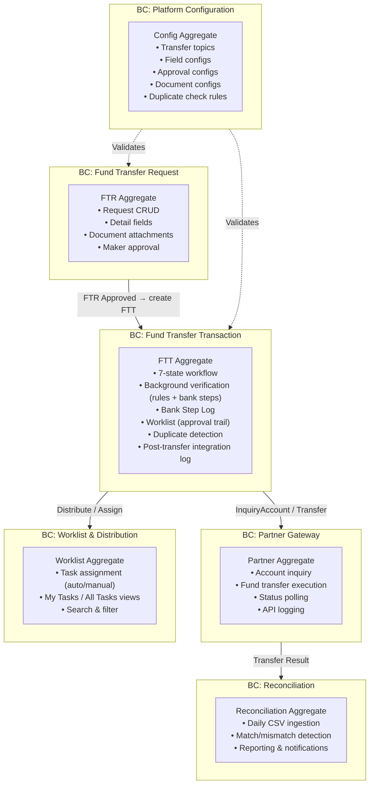
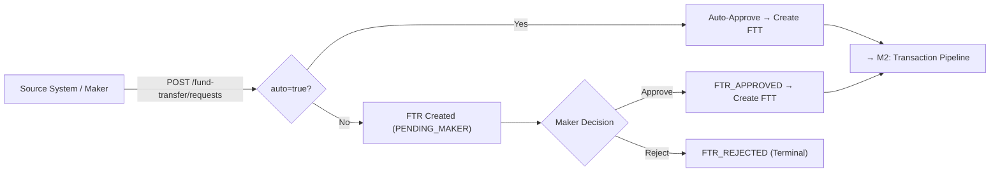
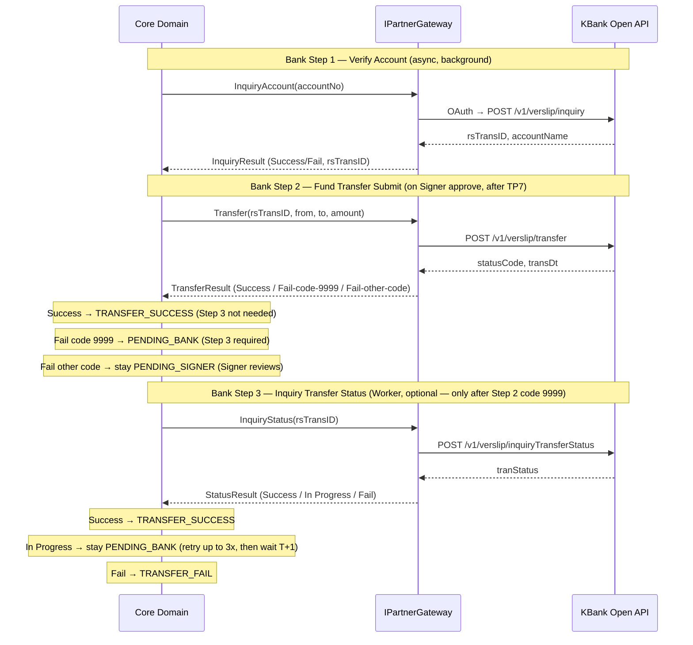
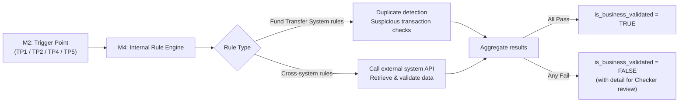
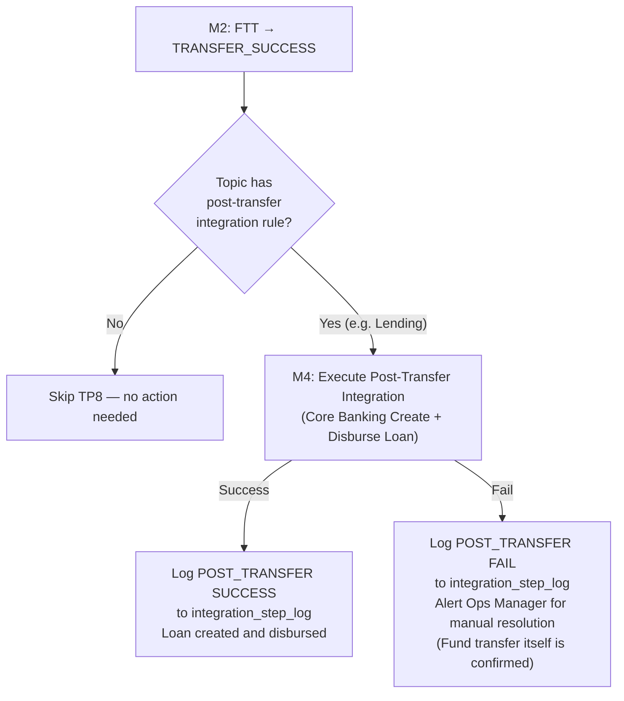
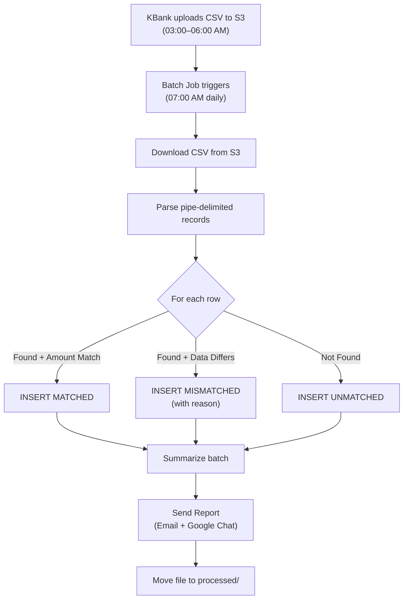
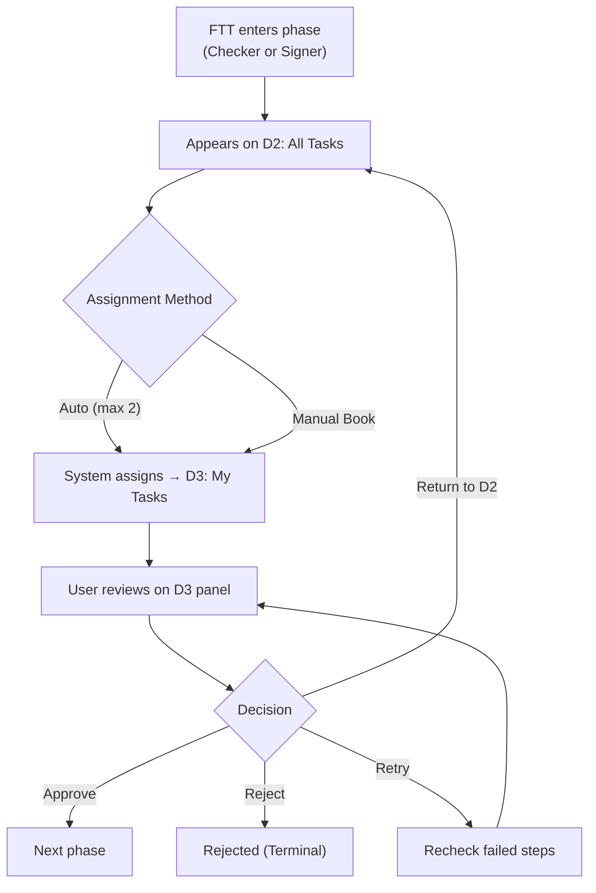
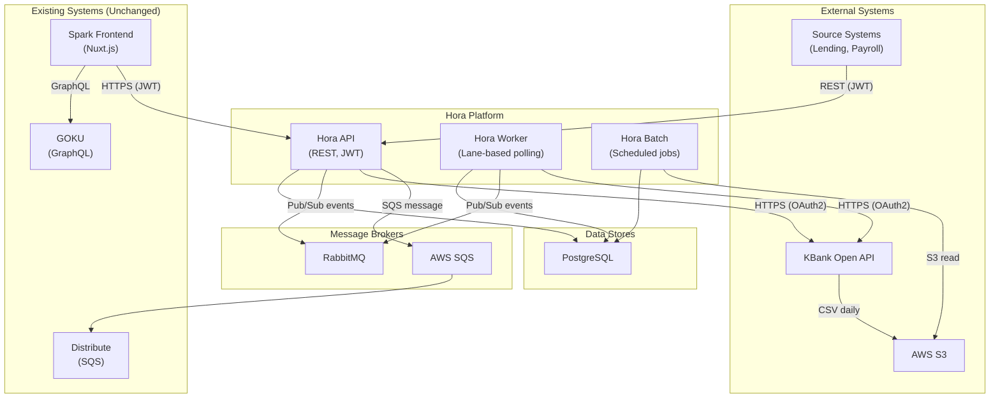

# Product Requirement Document — H2H Fund Transfer System

> **Project:** Hora — H2H Fund Transfer
> **Version:** v0.5 (Draft — Combined Revisions 1–6)
> **Status:** DRAFT — Awaiting User Confirmation
> **Last Updated:** 2026-03-13

---

## Change Log

| Review # | Date       | Section          | Description                             | Requester |
|----------|------------|------------------|-----------------------------------------|-----------|
| 0        | 2026-03-02 | All              | Initial draft from requirement idea + architecture blueprint | System    |
| 1        | 2026-03-04 | M1, M2, M6, S5.8, S10 | Combined revision: (R1) 9-state FTT machine with renamed states + `SUBMIT_FAILED`; (R2) Display capabilities D1–D4 added to owning modules + Display Catalog; (R3) FTR state definitions under M1. | User      |
| 2        | 2026-03-04 | M2 (C2.15, UC2.7), S5.8a | Added in-app transfer failure notification. Cross-display alert when FTT reaches `TRANSFER_FAILED`. | User      |
| 3        | 2026-03-06 | M2, M4, S4, S5.2, S5.4, S5.8, S5.8a, S6, S10 | (R4) FTT state machine reduced from 9→5 states. Bank interactions separated into Bank Step Log (Step 1–3). `BANK_SUBMITTED` state replaces SUBMITTING/PENDING_SETTLEMENT. COMPLETED/TRANSFER_FAILED/SUBMIT_FAILED removed as FTT states — outcomes recorded in Bank Step Log. M2 absorbs background verification scope. M4 renamed to "Internal Rule" (covers fund transfer system rules + cross-system rules). D4 triggered by bank Step 3 = Fail. Re-submit after Step 3 Fail returns FTT to `PENDING_CHECKER`. | User      |
| 4        | 2026-03-06 | M2, M4, S4, S5.2, S5.4, S5.8, S9, S10 | (R5) Added topic-specific Pre-Submission Integration Rule concept (TP6). Lending topic: Core Banking Create & Disburse Loan before bank Step 2. Integration Compensation (Core Banking Cancel Loan) auto-triggered on bank Step 2 Fail or bank Step 3 Fail. New `fund_transfer_integration_step_log`. Re-submit after Step 3 Fail re-runs TP6 from scratch. M4 gains C4.6 and C4.7. M2 gains C2.18 and C2.19. | User      |
| 5        | 2026-03-13 | M2, M3, M4, S5.2–5.4, S5.8, S5.8a, S6, S9, S10 | (R6) Partner API Step 2 now returns 3 outcomes: Success (confirmed transfer), Fail code 9999 (bank cannot confirm yet), Fail other code (known rejection). Step 3 is now optional — only triggered after code 9999. FTT state machine expanded from 5 → 7 states: added `PENDING_BANK` (Step 2 code 9999), `TRANSFER_SUCCESS` (Step 2 success or Step 3 success), `TRANSFER_FAIL` (Step 3 fail); removed `BANK_SUBMITTED`. TP6 pre-submission integration removed — Lending integration inverted: loan settlement (Create + Disburse) now runs **after** `TRANSFER_SUCCESS` as a post-transfer step (TP8). Pre-submission compensation logic removed. Step 3 polls up to 3 times; if still In Progress → wait T+1 reconcile file. New optional notification when FTT moves to `PENDING_BANK`. TRANSFER_FAIL is re-submittable (→ `PENDING_CHECKER`) or rejectable (→ `REJECTED`) by Ops. | User      |

---

## 1. Business Context & Goals

### 1.1 Problem Statement

The organisation currently operates fund transfers through **four separate repositories** (Hora, Argentinus, Mars, Spark) connected to the KKP (Kiatnakin) banking provider. This fragmentation results in:

- **23 distinct workflow states** — difficult to maintain, audit, and extend.
- **Tight coupling to a single bank partner** — no abstraction layer to onboard new partners.
- **Security gaps** identified in penetration testing (Mayaseven, ITSL audits) that must be resolved before next compliance window.
- **Manual-only request creation** — no programmatic (API-driven) entry point for upstream source systems.

### 1.2 Business Objectives

| # | Objective | Measurable Outcome |
|---|-----------|-------------------|
| O1 | **Consolidate into a single platform** | One monorepo (`Hora.sln`) replaces 4 repos. Single CI/CD pipeline. |
| O2 | **Simplify the workflow** | Reduce from 23 states to **7 internal FTT states** with config-driven business rules. Bank communication outcomes are the authoritative source of FTT terminal states — no separate Bank Step Log lookup needed to understand final transfer result. |
| O3 | **Enable multi-bank extensibility** | Partner abstraction (`IPartnerGateway`) — add future banks (SCB, BBL) without core changes. |
| O4 | **Support automated (API-driven) transfers** | External source systems can submit fund transfer requests via REST API with auto-approval. |
| O5 | **Ensure dual-control governance** | Maker → Checker → Signer approval chain with config-driven role validation. |
| O6 | **Achieve regulatory & security compliance** | Pass pentest (CVSS ≥ 9.3 findings mitigated), 7-year data retention, full audit trail. |
| O7 | **Provide real-time operational visibility** | Async background checks visible on worklist. Notifications on bank failures. Daily reconciliation. |
| O8 | **Reduce operational risk** | Config-driven duplicate detection (13 rules), double-click protection via `request_hash`, idempotent bank submissions. |

### 1.3 Value / Revenue Model

This is an **internal operational system** — value is measured in:

- **Cost avoidance** — fewer manual errors, reduced reconciliation effort.
- **Risk reduction** — fewer duplicate or fraudulent transfers.
- **Speed** — auto-approved transfers complete in minutes rather than hours.
- **Compliance** — avoiding regulatory fines via audit trail and security hardening.

---

## 2. Personas & Jobs-To-Be-Done

| Persona | Role | Jobs-To-Be-Done |
|---------|------|-----------------|
| **Source System** | External upstream system (e.g., Lending, Payroll) | Submit fund transfer requests programmatically via API (auto-approve mode). Receive status updates via events. |
| **Maker** (Operation Staff) | Creates and reviews Manual fund transfer requests | Create single or batch FTRs. Attach supporting documents. Approve or reject requests before they enter the pipeline. |
| **Checker** | First-level reviewer | Review assigned FTTs. Verify inquiry account results, internal validation results, and supporting documents. Approve, reject, or return to pool. Retry failed background checks. |
| **Signer** | Second-level approver (authoriser) | Final review of FTTs passed by Checker. Approve to trigger bank Step 2 submission. Reject with reason. Handle bank Step 2 failure (retry submission or reject). |
| **Operations Manager** | Supervisor / Escalation | Review FTTs where bank Step 3 (Inquiry Transfer Status) returned Fail (via D4). Decide to re-submit (good-to-have) or final reject. Monitor reconciliation reports. |
| **System Administrator** | Platform configuration | Configure transfer topics, approval steps, duplicate check rules, document requirements, bank partner settings. |
| **Auditor** | Compliance & audit | Query transaction history, worklist actions, bank API logs, Bank Step Log. Review reconciliation reports. |

---

## 3. Domain Map & Bounded Contexts

### 3.1 Bounded Contexts

### 3.2 Domain Integrity

| Boundary Check | Status |
|----------------|--------|
| FTR never directly modifies FTT state | ✅ Clean — FTR publishes `FTR_APPROVED` event, system creates FTT |
| Core domain never reads partner-specific tables | ✅ Clean — `IPartnerGateway` interface isolates partner domain |
| Worklist (GOKU/Distribute) remains external | ✅ Clean — existing system, no modification needed |
| Config changes do not require code deployment | ✅ Clean — DB-driven config tables |
| Reconciliation does not modify transaction state | ✅ Clean — read-only comparison, report-only |

---

## 4. Module Catalog

The system is decomposed into **six independently deployable modules** plus a cross-cutting configuration module.

| Module | Owner | Business Goal | Data Ownership |
|--------|-------|---------------|----------------|
| M1: Fund Transfer Request | Maker / Source System | Capture and validate transfer intent | `fund_transfer_request`, `_detail`, `_document` |
| M2: Fund Transfer Transaction | System / Checker / Signer | Execute the transfer lifecycle (7-state machine), coordinate background verification (internal rules + bank steps), and orchestrate topic-specific post-transfer integration steps | `fund_transfer_transaction`, `fund_transfer_worklist`, `fund_transfer_bank_step_log`, `fund_transfer_integration_step_log` |
| M3: Partner Gateway | System | Abstract bank partner communication | `kbank_transaction`, `kbank_transaction_log` |
| M4: Internal Rule | System (Worker) | Execute and manage internal business rule checks (fund transfer system rules + cross-system rules) and topic-specific post-transfer integration steps | Updates `is_business_validated` flag on `fund_transfer_transaction`; writes to `fund_transfer_integration_step_log` |
| M5: Reconciliation | System (Batch) | Ensure transfer accuracy via daily bank reconciliation | `kbank_reconcile_batch`, `kbank_reconcile_detail` |
| M6: Worklist & Distribution | GOKU / Distribute (existing) | Assign and display tasks to Checker / Signer | Managed by existing GOKU/Distribute systems |
| M7: Platform Configuration | System Administrator | Drive business rules without code changes | All `*_config` tables |

---

## 5. Module Details — Capabilities, Operation Flow & Use-Cases

---

### M1: Fund Transfer Request (FTR)

#### 5.1.1 Business Goal

Enable source systems and operation staff to **capture fund transfer intent** with full supporting data (details, documents) before entering the execution pipeline.

#### 5.1.2 Capabilities

| # | Capability | Description |
|---|-----------|-------------|
| C1.1 | **Create FTR (API — Auto-Approve)** | External system submits FTR via REST API with `auto=true`. System auto-approves and immediately creates an FTT. |
| C1.2 | **Create FTR (Manual — Single Entry)** | Maker creates an FTR via Spark UI with individual form entry. FTR enters `PENDING_MAKER` state. |
| C1.3 | **Create FTR (Manual — Batch Upload)** | Maker uploads a batch file (CSV/Excel) to create multiple FTRs in one action. Each FTR enters `PENDING_MAKER`. |
| C1.4 | **Attach Documents** | Maker or source system attaches supporting evidence (photo, PDF) to an FTR. Validated by file type (magic number), max size, UUID filename. |
| C1.5 | **Maker Approve FTR** | Maker reviews FTR details and documents, then approves → system creates FTT. |
| C1.6 | **Maker Reject FTR** | Maker rejects an FTR with reason. Status → `FTR_REJECTED`. Published to source system. Terminal state. |
| C1.7 | **Config-Driven Validation** | Required fields, document types, and field labels are determined by `TransferTopicConfig` — no hardcoded rules. |
| C1.8 | **D1: Create FTR Form** | Spark UI form for manual FTR creation. Fields are driven by `TransferTopicFieldConfig` (dynamic labels, required/optional per topic). Includes account selection (source/destination), amount, proxy type, and reference fields. |
| C1.9 | **D1: FTR Review & Decision** | Maker reviews FTR summary — transfer details, attached documents, validation warnings. Actions: Approve (→ create FTT) or Reject (with reason). For batch uploads, provides a batch summary view with individual FTR drill-down. |

#### 5.1.2a FTR State Definitions

| # | State | Definition | Actor | Terminal? |
|---|-------|-----------|-------|-----------|
| 1 | **PENDING_MAKER** | FTR has been created via manual entry (single or batch). Maker reviews transfer details and attached documents before deciding. Not applicable for auto-approve flow (`auto=true` skips this state entirely). | Maker | No |
| 2 | **FTR_APPROVED** | Maker approved the FTR (or system auto-approved via API). System creates an FTT and the transaction enters the approval pipeline. Event published to source system. | System | **Yes** |
| 3 | **FTR_REJECTED** | Maker rejected the FTR with a mandatory reason. No FTT is created. Event published to source system. A new FTR must be created if the transfer is still needed. | Maker | **Yes** |

> **Note:** For the auto-approve flow (`auto=true`), the FTR is created and immediately transitions to `FTR_APPROVED` — the `PENDING_MAKER` state is skipped entirely.

#### 5.1.3 Operation Flow

#### 5.1.4 Use-Cases

| # | Use-Case | Actor | Scenario |
|---|----------|-------|----------|
| UC1.1 | Lending system auto-transfer | Source System | Lending system approves a loan disbursement → calls API with `auto=true` → FTR + FTT created instantly → enters approval pipeline. |
| UC1.2 | Payroll batch upload | Maker | HR Maker uploads a CSV of 500 salary payments → system creates 500 individual FTRs → Maker reviews summary → approves all → 500 FTTs created. |
| UC1.3 | Manual single vendor payment | Maker | Maker creates FTR for a one-off vendor payment → attaches invoice PDF → approves → FTT enters pipeline. |
| UC1.4 | Reject incorrect request | Maker | Maker notices wrong account number → rejects FTR with reason "incorrect beneficiary account" → source system notified → new FTR created with corrected data. |
| UC1.5 | Missing document rejection | Maker | Maker reviews FTR but required tax invoice document (per `TopicDocumentConfig`) is missing → system prevents approval until document is attached. |

---

### M2: Fund Transfer Transaction (FTT)

#### 5.2.1 Business Goal

Execute the full **Maker → Checker → Signer** approval lifecycle for each fund transfer, ensuring dual-control governance, auditability, and consistent state management. M2 also coordinates **background verification** — orchestrating internal rule checks (M4) and bank step interactions (M3) — records each bank API call result in the **Bank Step Log**, and triggers topic-specific **post-transfer integration steps** after a confirmed successful transfer.

#### 5.2.2 Capabilities

| # | Capability | Description |
|---|-----------|-------------|
| C2.1 | **Create FTT** | System creates FTT record with status `CREATED` upon FTR approval. Triggers parallel background checks (M4 internal rule check + bank Step 1 via M3). |
| C2.2 | **7-State Workflow Engine** | See state definition table (5.2.2a) and Bank Step Log table (5.2.2b) below. |
| C2.3 | **Checker Review & Decision** | Checker reviews FTT details, background check results, documents. Can Approve (requires `is_ready_to_check=TRUE`), Reject, Retry failed checks, or Return to pool. |
| C2.4 | **Signer Review & Decision** | Signer performs final review. Can Approve (triggers TP7 ref key check, then bank Step 2 submission), Reject, Retry checks, or Return to pool. Bank Step 2 has three possible outcomes: (1) **Success** → FTT moves to `TRANSFER_SUCCESS`; (2) **Fail with code 9999** → bank cannot confirm execution yet → FTT moves to `PENDING_BANK`, removed from Signer's task queue; (3) **Fail with other error code** → bank rejected for a known reason → FTT **remains in `PENDING_SIGNER`**, Signer sees the bank error detail and may retry or reject. |
| C2.5 | **Double-Click Protection** | `request_hash` (SHA256) with partial unique index on active statuses prevents duplicate transaction creation. |
| C2.6 | **Rejection Workflow** | Reject requires reason (dropdown, mandatory) + optional remark. Rejection is terminal — no rework loop. New FTR must be created. |
| C2.7 | **Re-Submit After Transfer Fail** | When FTT is in `TRANSFER_FAIL` state, Ops can re-submit from D4. System re-triggers background checks and returns FTT to `PENDING_CHECKER` pipeline. Ops may also reject (→ `REJECTED`) instead. (Good-to-have) |
| C2.8 | **Status Publication** | Every FTT state transition publishes an event to the source system (via RabbitMQ pub/sub). Key terminal events: `ftt.transfer_success` (FTT → `TRANSFER_SUCCESS`) and `ftt.transfer_fail` (FTT → `TRANSFER_FAIL`). |
| C2.9 | **D3: Review Panel (Shared Screen)** | Single shared screen used by both Checker and Signer. Content is identical regardless of role. Displays: ① FTT details (txn ID, amount, accounts, beneficiary), ② Background check results with status indicators (✅/⏳/❌), ③ Attached documents from FTR, ④ Bank Step Log history for this FTT, ⑤ Bank Step 2 fail detail and error code if the most recent Step 2 attempt failed with a non-9999 code (FTT in `PENDING_SIGNER`). |
| C2.10 | **D3: Checker Actions** | Available when FTT is in `PENDING_CHECKER` and assigned to current user. Actions: Approve (requires `is_ready_to_check=TRUE`), Reject (reason dropdown mandatory + optional remark), Retry (re-trigger failed background checks), Return to D2 (unassign from self). |
| C2.11 | **D3: Signer Actions** | Available when FTT is in `PENDING_SIGNER` and assigned to current user. Actions: Approve (triggers TP7 then bank Step 2 submission), Reject, Retry checks, Return to D2. |
| C2.12 | **D3: Signer Actions — Bank Step 2 Fail (non-9999)** | Applicable when FTT is in `PENDING_SIGNER` and the most recent bank Step 2 result was Fail with a non-9999 error code (known bank rejection reason). System displays bank error code and fail reason prominently. **Signer must review the bank fail reason before any retry action is enabled.** Actions: Re-submit (retry bank Step 2) or Reject (with reason → `REJECTED`). |
| C2.13 | **D4: Transfer Failure Detail Screen** | Displayed when FTT is in `TRANSFER_FAIL` state (bank Step 3 returned Fail or T+1 reconcile file confirmed failure). Shows: bank result code & description, full Bank Step Log for this FTT, full FTT history (created by, Checker, Signer, timestamps), FTT details, attached documents. |
| C2.14 | **D4: Failure Resolution Actions** | Actions on D4: Re-submit (good-to-have) — re-triggers background checks, returns to `PENDING_CHECKER`. Reject — final decision, status → `REJECTED`. |
| C2.15 | **In-App Transfer Failure Alert** | When FTT transitions to `TRANSFER_FAIL`, system pushes a real-time in-app notification to all users associated with the FTT (Maker, Checker, Signer, configured Ops Managers). Notification appears as a banner/toast on any active display. Content: txn ID, amount, beneficiary, bank failure reason, deep-link to D4. |
| C2.16 | **Bank Step Log** | System records every bank API call result as a step log entry attached to the FTT. Captures: step number, step name, result, bank response code, timestamp. A single FTT may have multiple Step 2 entries (retries) or multiple Step 3 entries (polling). Step 3 entries only exist when Step 2 failed with code 9999. Stored in `fund_transfer_bank_step_log`. |
| C2.17 | **Background Verification Coordination** | M2 orchestrates two parallel verification tracks at key trigger points: (1) bank Step 1 (Verify Account) via M3, and (2) Internal Rule check via M4. Results update `is_account_verified` and `is_business_validated` flags respectively. Readiness gate `is_ready_to_check = is_account_verified AND is_business_validated` blocks Checker approval until both pass. Checker/Signer can manually retry failed checks from D3. |
| C2.18 | **Post-Transfer Integration Coordination (TP8)** | After FTT transitions to `TRANSFER_SUCCESS`, M2 checks if the FTT topic has a configured post-transfer integration step (via M4). If yes, executes it asynchronously at TP8. **Lending topic:** M4 calls Core Banking to Create loan account and Disburse loan principal. Result is recorded in `fund_transfer_integration_step_log`. If the post-transfer integration fails — Ops Manager is alerted (the fund transfer itself is already confirmed successful and cannot be reversed by the system at this point). Topics with no post-transfer integration rule skip TP8 entirely. |
| C2.19 | **PENDING_BANK Notification (Optional)** | When FTT transitions to `PENDING_BANK` (Step 2 fail code 9999), system sends an optional in-app notification to the Signer who approved the transfer. Content: "Transfer #[txn ID] submitted — awaiting bank confirmation. You will be notified of the final result." This informs the Signer that their approval succeeded but the final bank outcome is pending, and the FTT has moved out of their task queue. |

#### 5.2.2a FTT State Definitions

| # | State | Definition | Actor | Terminal? |
|---|-------|-----------|-------|-----------|
| 1 | **CREATED** | FTT record has been created from an approved FTR. Parallel background checks are triggered immediately: bank Step 1 (Verify Account) via M3, and Internal Rule check via M4. FTT proceeds to distribution without waiting for check results. | System | No |
| 2 | **PENDING_CHECKER** | FTT has been distributed to the Checker pool (D2). Awaiting assignment and review. Checker cannot approve until `is_ready_to_check = TRUE` (both background checks passed). | Checker | No |
| 3 | **PENDING_SIGNER** | Checker has approved. FTT has been distributed to the Signer pool (D2). When Signer approves, the following sequence executes: (1) **TP7** — ref key validity check; (2) **Bank Step 2** — Fund Transfer Submit. Step 2 has three outcomes: **Success** → FTT moves to `TRANSFER_SUCCESS`; **Fail with code 9999** → FTT moves to `PENDING_BANK`; **Fail with other code** → FTT **remains in `PENDING_SIGNER`** and Signer sees the bank error detail (may retry or reject). | Signer | No |
| 4 | **PENDING_BANK** | Signer approved and system submitted bank Step 2, but bank returned Fail with error code 9999 — bank cannot yet confirm whether the fund transfer was executed or not. System Worker submits bank Step 3 (Inquiry Transfer Status) up to 3 times at configurable intervals. If Step 3 returns In Progress after all retries, FTT remains in `PENDING_BANK` until the T+1 reconcile file provides the final result. FTT is **moved out of Signer's task queue**. Transitions: Step 3 Success → `TRANSFER_SUCCESS`; Step 3 Fail → `TRANSFER_FAIL`; T+1 reconcile Success/Fail → same. | System (Worker / Reconciliation) | No |
| 5 | **REJECTED** | Checker or Signer rejected the FTT with a mandatory reason; OR Operations Manager rejected from D4 while FTT was in `TRANSFER_FAIL`. Event published to source system. No rework — a new FTR must be created. | Checker / Signer / Ops | **Yes** |
| 6 | **TRANSFER_SUCCESS** | Fund transfer confirmed successful by the bank. Two possible triggers: (a) bank Step 2 returns Success directly; (b) bank Step 3 returns Success (after Step 2 failed with code 9999). After entering this state, M2 triggers TP8 — post-transfer integration for applicable topics (e.g., Lending: Create loan account + Disburse). Event published to source system. | System | **Yes** |
| 7 | **TRANSFER_FAIL** | Fund transfer confirmed failed. Triggered by bank Step 3 returning Fail (after `PENDING_BANK`), or T+1 reconcile file confirming failure. D4 is displayed to Operations — they may re-submit (→ `PENDING_CHECKER`) or reject (→ `REJECTED`). In-app failure notification is pushed to associated users. | System (Worker / Reconciliation) | No (Ops re-submits or rejects) |

> **Key principle:** FTT state is the **single authoritative source** for the transfer outcome. `TRANSFER_SUCCESS` and `TRANSFER_FAIL` are explicit terminal outcomes — no cross-referencing with the Bank Step Log is needed to understand the final result.

#### 5.2.2b Bank Step Log

Each FTT maintains a **Bank Step Log** — an ordered record of every bank API call made for that FTT. Bank step outcomes now directly drive FTT state transitions.

| Step | Name | Result Values | Effect on FTT State | Notes |
|------|------|--------------|---------------------|-------|
| Step 1 | Verify Account | Success / Fail | **None** | Run as background check after FTT creation (TP1) and before Signer phase (TP4). Updates `is_account_verified` flag. |
| Step 2 | Fund Transfer Submit | Success / Fail (code 9999) / Fail (other code) | **Success → `TRANSFER_SUCCESS`** (terminal); **Fail (code 9999) → `PENDING_BANK`**; **Fail (other code) → stays `PENDING_SIGNER`** | Triggered when Signer approves (after TP7). If Success, Step 3 is **not needed**. May have multiple entries if Signer retries after a non-9999 Fail. |
| Step 3 | Inquiry Transfer Status | Success / Fail / In Progress | **Success → `TRANSFER_SUCCESS`**; **Fail → `TRANSFER_FAIL`**; **In Progress → stays `PENDING_BANK`** | **Optional — only executed when Step 2 fails with code 9999.** Worker polls up to 3 times with configurable interval. If still In Progress after 3 retries → FTT remains `PENDING_BANK` until T+1 reconcile file. |

> **Note — T+1 Reconcile:** When bank Step 3 remains In Progress after 3 polling retries, the reconcile file (uploaded by bank at T+1) determines the final outcome. System processes the file and transitions FTT from `PENDING_BANK` to either `TRANSFER_SUCCESS` or `TRANSFER_FAIL`.

**Example step log — Step 2 success (Step 3 not needed):**

| FTT | Step | Name | Result | FTT State After |
|-----|------|------|--------|----------------|
| FTT-001 | Step 1 | Verify Account | Success | PENDING_CHECKER |
| FTT-001 | Step 2 | Fund Transfer Submit | Success | **TRANSFER_SUCCESS** |

**Example step log — Step 2 code 9999 → Step 3 success:**

| FTT | Step | Name | Result | FTT State After |
|-----|------|------|--------|----------------|
| FTT-002 | Step 1 | Verify Account | Success | PENDING_CHECKER |
| FTT-002 | Step 2 | Fund Transfer Submit | Fail code 9999 | **PENDING_BANK** |
| FTT-002 | Step 3 | Inquiry Transfer Status | In Progress | PENDING_BANK |
| FTT-002 | Step 3 | Inquiry Transfer Status | In Progress | PENDING_BANK |
| FTT-002 | Step 3 | Inquiry Transfer Status | Success | **TRANSFER_SUCCESS** |

**Example step log — Step 2 non-9999 fail then Signer retry success:**

| FTT | Step | Name | Result | FTT State After |
|-----|------|------|--------|----------------|
| FTT-003 | Step 1 | Verify Account | Success | PENDING_CHECKER |
| FTT-003 | Step 2 | Fund Transfer Submit | Fail (ERR-1001) | PENDING_SIGNER |
| FTT-003 | Step 2 | Fund Transfer Submit | Success (Signer retried) | **TRANSFER_SUCCESS** |

#### 5.2.2c Background Verification Trigger Points

| Trigger Point | Checks Executed | When |
|---------------|----------------|------|
| TP1 | Bank Step 1 (Verify Account) + Internal Rule check (M4) | FTT created |
| TP2 | Internal Rule check (M4) only | Checker assignment (auto or manual) |
| TP4 | Bank Step 1 (Verify Account) + Internal Rule check (M4) | After Checker approval, before Signer phase |
| TP5 | Internal Rule check (M4) only | Signer assignment (auto or manual) |
| TP7 | Verification Ref Key validity check (`rsTransID` expiry) | After Signer approval, before bank Step 2 submission |
| TP8 | Topic-specific post-transfer integration step via M4 (if topic has one) | After FTT transitions to `TRANSFER_SUCCESS` |

> **Note — TP6 removed:** Pre-submission integration (TP6) has been removed. For Lending topic, loan settlement now happens **after** the bank confirms the transfer is successful (TP8), not before submission. This eliminates the need for compensation actions when bank Step 2 or Step 3 fails.

#### 5.2.2d Integration Step Log

Each FTT that involves a topic-specific integration rule maintains an **Integration Step Log** — separate from the Bank Step Log — recording every post-transfer integration step executed after `TRANSFER_SUCCESS`.

Stored in `fund_transfer_integration_step_log`.

| Column | Description |
|--------|-------------|
| `ftt_id` | Reference to the FTT |
| `action_type` | `POST_TRANSFER` (post-success integration step) |
| `action_name` | e.g., "Core Banking Create & Disburse Loan" |
| `result` | Success / Fail |
| `detail` | Failure reason or response detail from the external system |
| `triggered_by` | e.g., `TP8_TRANSFER_SUCCESS` |
| `created_at` | Timestamp |

**Example log for a Lending FTT (Step 2 success → post-transfer loan settlement):**

| FTT | Action Type | Action Name | Result | Triggered By |
|-----|-------------|-------------|--------|--------------|
| FTT-001 | POST_TRANSFER | Core Banking Create & Disburse Loan | Success | TP8_TRANSFER_SUCCESS |

**Example log for a Lending FTT (Step 3 success → post-transfer loan settlement fails):**

| FTT | Action Type | Action Name | Result | Triggered By |
|-----|-------------|-------------|--------|--------------|
| FTT-002 | POST_TRANSFER | Core Banking Create & Disburse Loan | Fail (loan account config error) | TP8_TRANSFER_SUCCESS |

> **Note — TP8 Failure:** If post-transfer loan settlement fails, the fund transfer is already confirmed successful and irreversible. System alerts Ops Manager to investigate and resolve the loan settlement manually. No automatic compensation is applied.

#### 5.2.3 Operation Flow

```mermaid
stateDiagram-v2
    [*] --> CREATED: FTR Approved → System creates FTT

    CREATED --> PENDING_CHECKER: Distribute to Checker (SQS)

    PENDING_CHECKER --> PENDING_SIGNER: Checker approves (is_ready_to_check=TRUE)
    PENDING_CHECKER --> REJECTED: Checker rejects (reason required)

    PENDING_SIGNER --> TRANSFER_SUCCESS: Signer approves → [TP7] → Bank Step 2 SUCCESS\n(transfer confirmed — Step 3 not needed)
    PENDING_SIGNER --> PENDING_BANK: Signer approves → [TP7] → Bank Step 2 FAIL code 9999\n(bank cannot confirm yet → Step 3 required)
    PENDING_SIGNER --> PENDING_SIGNER: Signer approves → Bank Step 2 FAIL (other code)\n(logged; FTT stays; Signer retries or rejects)
    PENDING_SIGNER --> REJECTED: Signer rejects (reason required)

    PENDING_BANK --> TRANSFER_SUCCESS: Step 3 SUCCESS or T+1 reconcile SUCCESS
    PENDING_BANK --> TRANSFER_FAIL: Step 3 FAIL or T+1 reconcile FAIL

    TRANSFER_FAIL --> PENDING_CHECKER: Ops re-submits via D4 (good-to-have)
    TRANSFER_FAIL --> REJECTED: Ops rejects via D4

    TRANSFER_SUCCESS --> [*]: TP8 post-transfer integration triggered (if applicable)
    REJECTED --> [*]
```

> **Note — Step 3 (Optional):** Bank Step 3 (Inquiry Transfer Status) is **only executed** when Step 2 fails with error code 9999. Worker polls up to 3 times. If In Progress after all retries → FTT waits in `PENDING_BANK` until T+1 reconcile file.
>
> **Note — TP8 (Post-Transfer Integration):** Executed asynchronously after `TRANSFER_SUCCESS` for topics with a configured post-transfer integration rule (e.g., Lending: Create loan account + Disburse). Topics without a rule skip TP8. Fund transfer success is confirmed regardless of TP8 result.

#### 5.2.4 Use-Cases

| # | Use-Case | Actor | Scenario |
|---|----------|-------|----------|
| UC2.1 | Standard approval flow — Step 2 success | Checker → Signer | FTT `CREATED` → distributed → `PENDING_CHECKER` → Checker verifies checks pass → approves → `PENDING_SIGNER` → Signer approves → TP7 → bank Step 2 → **Step 2 Success** → FTT transitions to `TRANSFER_SUCCESS` → source system notified → TP8 post-transfer integration triggered (if applicable). |
| UC2.2 | Checker rejects suspicious duplicate | Checker | FTT in `PENDING_CHECKER` → Checker sees duplicate warning from M4 → confirms duplicate → rejects with reason → `REJECTED` → source system notified. |
| UC2.3 | Signer handles bank Step 2 failure (non-9999) | Signer | Signer approves → bank Step 2 → bank returns Fail with known error code (e.g., ERR-1001 invalid account) → Step 2 result recorded in Bank Step Log → FTT **remains** `PENDING_SIGNER` → bank error code displayed prominently on D3 → Signer reviews reason → resolves issue → re-approves → bank Step 2 retried → Step 2 Success → `TRANSFER_SUCCESS`. |
| UC2.4 | Signer rejects after bank Step 2 failure (non-9999) | Signer | FTT in `PENDING_SIGNER` with Step 2 non-9999 Fail → Signer reviews bank error on D3 → determines unresolvable → rejects with reason → `REJECTED`. |
| UC2.5 | Bank Step 2 code 9999 → Step 3 polling → success | System → Ops | Signer approves → Step 2 returns code 9999 → FTT moves to `PENDING_BANK` → Signer receives optional notification "awaiting bank confirmation" → Worker polls Step 3 → Step 3 returns Success (2nd poll) → FTT transitions to `TRANSFER_SUCCESS` → source system notified. |
| UC2.6 | Bank Step 2 code 9999 → Step 3 fail → Ops re-submits | Ops Manager | FTT in `PENDING_BANK` → Worker polls Step 3 → bank returns Fail → FTT transitions to `TRANSFER_FAIL` → in-app failure notification sent → D4 displayed with full Bank Step Log → Ops re-submits (good-to-have) → background checks re-triggered → FTT returns to `PENDING_CHECKER` → same approval pipeline. |
| UC2.7 | Bank Step 2 code 9999 → Step 3 still In Progress → T+1 reconcile | System | Signer approves → Step 2 returns code 9999 → FTT moves to `PENDING_BANK` → Worker polls Step 3 three times → all return In Progress → FTT stays `PENDING_BANK` → next day KBank uploads reconcile CSV → Batch Job processes file → finds match → FTT transitions to `TRANSFER_SUCCESS` (or `TRANSFER_FAIL` if reconcile shows failure). |
| UC2.8 | Real-time transfer failure notification | System → Ops | FTT in `PENDING_BANK` → Worker polls Step 3 → Fail → FTT moves to `TRANSFER_FAIL` → notification toast appears on all associated users' screens: "Transfer #FTT-2026-0042 FAILED — Insufficient funds" → Ops clicks → navigated to D4 → reviews full Bank Step Log → decides to reject. |
| UC2.9 | Checker returns task to pool | Checker | Checker picks up FTT but lacks topic knowledge → returns FTT to D2 → another Checker books it manually. |
| UC2.10 | Lending topic — Step 2 success → post-transfer loan settlement | System | Signer approves Lending FTT → TP7 → bank Step 2 → Step 2 Success → FTT transitions to `TRANSFER_SUCCESS` → M2 triggers TP8 → M4 calls Core Banking → Create loan account + Disburse success → integration step logged. Loan disbursed after confirmed fund transfer. |
| UC2.11 | Lending topic — Step 3 success → post-transfer loan settlement | System | Signer approves Lending FTT → Step 2 fails code 9999 → `PENDING_BANK` → Worker polls Step 3 → Success → FTT → `TRANSFER_SUCCESS` → M2 triggers TP8 → Core Banking Create + Disburse → success → integration step logged. |
| UC2.12 | Lending topic — post-transfer loan settlement fails | System → Ops | FTT → `TRANSFER_SUCCESS` → TP8 → Core Banking Create + Disburse fails (e.g., loan config error) → Fail logged in integration step log → Ops Manager alerted → manual intervention required to create and disburse the loan. Fund transfer itself is confirmed and irreversible. |

---

### M3: Partner Gateway

#### 5.3.1 Business Goal

**Abstract bank partner communication** behind a clean interface (`IPartnerGateway`) so the core domain is partner-agnostic and future banks can be integrated without core workflow changes.

#### 5.3.2 Capabilities

| # | Capability | Description |
|---|-----------|-------------|
| C3.1 | **Account Inquiry** | Verify destination bank account via bank API. Returns account name + verification reference key (`rsTransID`). |
| C3.2 | **Fund Transfer Execution** | Submit fund transfer to bank using verified `rsTransID`. Returns submission confirmation. |
| C3.3 | **Transfer Status Inquiry** | Poll bank API for transfer result (Success / Pending / Fail). |
| C3.4 | **OAuth Token Management** | Obtain and cache bank OAuth tokens (25-min cache, max 5 requests per 30-min window). |
| C3.5 | **Verification Ref Key Validity** | Check if `rsTransID` is expired before submission. If expired, re-verify to obtain a new key. |
| C3.6 | **API Audit Logging** | Log all OAUTH, INQUIRY, and TRANSFER API calls to `kbank_transaction_log`. Do NOT log status polling (high-frequency, low audit value). |
| C3.7 | **Partner Isolation** | Core domain accesses partner only via `IPartnerGateway` interface. Partner tables (`kbank_*`) are never joined directly by core queries. |

#### 5.3.3 Operation Flow

#### 5.3.4 Use-Cases

| # | Use-Case | Actor | Scenario |
|---|----------|-------|----------|
| UC3.1 | Successful account verification | System | FTT created → Worker calls KBank Inquiry (Step 1) → account exists, name matches → `is_account_verified=TRUE` → Checker can proceed. |
| UC3.2 | Account verification fails | System | KBank returns "account not found" (Step 1 Fail) → `is_account_verified=FALSE` → Checker sees ❌ on inquiry result → cannot approve → rejects or waits for retry. |
| UC3.3 | Transfer with expired ref key | System | Signer approves after 2 hours → `rsTransID` expired (TP7 check) → system automatically re-verifies account (new Step 1) → obtains new `rsTransID` → submits Step 2 with new key. |
| UC3.4 | KBank API timeout during Step 2 | System | Step 2 call times out → result treated as non-9999 Fail → recorded in Bank Step Log → FTT remains `PENDING_SIGNER` → Signer sees error on D3 → re-approves → system retries Step 2. |
| UC3.5 | Step 2 returns code 9999 | System | Signer approves → Step 2 call returns Fail with code 9999 → recorded in Bank Step Log → FTT transitions to `PENDING_BANK` → Worker begins polling Step 3. |
| UC3.6 | Future SCB partner integration | System Admin | New SCB partner onboarded → `ScbGateway : IPartnerGateway` implemented → new `scb_transaction` table created → core workflow unchanged → configured via `appsettings.json`. |

---

### M4: Internal Rule

#### 5.4.1 Business Goal

Provide a centralized **internal rule engine** that evaluates business rules for fund transfer transactions. Covers both rules within the fund transfer system (duplicate detection, suspicious transaction checks) and **cross-system rules** that reference or interact with other platforms to validate transfer conditions.

#### 5.4.2 Capabilities

| # | Capability | Description |
|---|-----------|-------------|
| C4.1 | **Duplicate Detection Rules** | Evaluate config-driven rules checking `fund_transfer_request` + `_detail` tables for potential duplicates (13 configurable rules). Returns Pass (no duplicate) or Fail (duplicate found) with match details. |
| C4.2 | **Suspicious Transaction Checks** | Evaluate rules identifying unusual patterns (e.g., abnormal amounts, unusual beneficiary, repeated targets). Configurable per topic. |
| C4.3 | **Cross-System Rule Validation** | Evaluate rules requiring data from or interaction with other internal systems (e.g., validating against a loan system, payroll system, or other operational platforms). M4 calls the relevant system API and evaluates the response against the rule condition. |
| C4.4 | **Validation Result Flag** | Updates `is_business_validated` flag on the FTT upon rule evaluation. Any Fail sets `is_business_validated=FALSE`. All rules Pass sets `is_business_validated=TRUE`. |
| C4.5 | **On-Demand Evaluation** | M4 is invoked by M2 at configured trigger points (TP1, TP2, TP4, TP5). Rule results are returned asynchronously and displayed on D2/D3 with status indicators (✅/⏳/❌). |
| C4.6 | **Topic-Specific Post-Transfer Integration Step (TP8)** | For topics with a configured post-transfer integration rule, M4 executes the integration step after FTT transitions to `TRANSFER_SUCCESS`. **Lending topic:** calls Core Banking system to Create loan account and Disburse loan principal. Executed asynchronously — fund transfer outcome is already confirmed before this step runs. Returns Success or Fail with detail. Result is recorded in `fund_transfer_integration_step_log`. If Fail, Ops Manager is alerted for manual resolution — no automatic compensation. |

#### 5.4.3 Operation Flow

**Background rule evaluation (TP1 / TP2 / TP4 / TP5):**

**Post-transfer integration step (TP8):**

#### 5.4.4 Use-Cases

| # | Use-Case | Actor | Scenario |
|---|----------|-------|----------|
| UC4.1 | All rules pass | System | M2 triggers M4 at TP1 → M4 evaluates all applicable rules → no duplicates, no suspicious patterns, cross-system checks pass → `is_business_validated=TRUE` → Checker can proceed. |
| UC4.2 | Duplicate detected | System | M4 rule evaluation detects matching reference_number + amount → `is_business_validated=FALSE` → Checker sees ⚠️ duplicate warning on D3. Soft warning — Checker uses judgement to approve or reject. |
| UC4.3 | Cross-system rule check | System | M4 evaluates a rule requiring data from an external system → calls the system API → validates response against rule condition → returns Pass/Fail result to M2. |
| UC4.4 | Stale data recheck on assignment | System | FTT sat in "All Tasks" for 30 minutes → Checker gets assigned → TP2 triggers M4 → re-evaluates rules with current data → catches a new duplicate that was created in the meantime. |
| UC4.5 | Lending — post-transfer loan settlement success (TP8) | System | FTT transitions to `TRANSFER_SUCCESS` → M2 triggers M4 at TP8 → M4 calls Core Banking → Create loan account + Disburse Principal → Success → POST_TRANSFER entry logged. Loan is now active. |
| UC4.6 | Lending — post-transfer loan settlement fails (TP8) | System → Ops | FTT transitions to `TRANSFER_SUCCESS` → M2 triggers M4 at TP8 → Core Banking returns Fail (e.g., loan account config error) → Fail logged in integration step log → Ops Manager alerted → manual intervention required to complete loan creation. Fund transfer is confirmed and unaffected. |

---

### M5: Reconciliation

#### 5.5.1 Business Goal

Provide a daily **automated comparison** between the system's transfer records and KBank's settlement records to detect mismatches, ensure financial accuracy, and satisfy audit requirements.

#### 5.5.2 Capabilities

| # | Capability | Description |
|---|-----------|-------------|
| C5.1 | **CSV Ingestion** | Download daily reconciliation CSV from S3 (uploaded by KBank at 03:00-06:00 AM). Pipe-delimited format. |
| C5.2 | **Three-Way Match** | Classify each record as: MATCHED (found + amount matches), MISMATCHED (found + data differs), or UNMATCHED (not found in system). |
| C5.3 | **Batch Summary** | Record total / matched / mismatched / unmatched counts per file in `kbank_reconcile_batch`. |
| C5.4 | **Detail Logging** | Store per-record reconcile result with mismatch reason in `kbank_reconcile_detail`. |
| C5.5 | **Notification** | Send reconciliation report via Email and Google Chat. Highlight mismatches and unmatched records. |
| C5.6 | **File Management** | Move processed files to `processed/` folder. Move failed files to `failed/` folder. |

#### 5.5.3 Operation Flow

#### 5.5.4 Use-Cases

| # | Use-Case | Actor | Scenario |
|---|----------|-------|----------|
| UC5.1 | Clean reconciliation day | System | All 200 records from KBank CSV match system records → report shows 200 MATCHED, 0 MISMATCHED, 0 UNMATCHED → no action needed. |
| UC5.2 | Amount mismatch detected | Ops Manager | KBank shows THB 50,000 but system recorded THB 55,000 → MISMATCHED flagged with reason "amount_mismatch" → Ops investigates source system. |
| UC5.3 | Unmatched KBank record | Ops Manager | KBank CSV contains a `rsTransID` not found in system → UNMATCHED → could indicate manual transfer at bank or data sync issue → escalated for investigation. |
| UC5.4 | File parse failure | System | CSV has corrupted row → file moved to `failed/` → notification sent with error detail → KBank re-sends or file manually corrected. |

---

### M6: Worklist & Distribution

#### 5.6.1 Business Goal

Provide **task assignment and visibility** so Checkers and Signers can efficiently find, claim, and process FTTs.

#### 5.6.2 Capabilities

| # | Capability | Description |
|---|-----------|-------------|
| C6.1 | **D2: All Tasks View** | Display all FTTs for a given phase (Checker or Signer). Shows: FTT summary (txn ID, amount, beneficiary, topic), background check progress indicators (✅ Done / ⏳ In Progress / ❌ Error), current FTT status. No retry action on D2 — retry is available only on D3. |
| C6.2 | **D2: Search & Filter** | Search FTTs by contract number (`reference_number`) or full name (`request_detail.reference1`). Uses POST method for sensitive data. |
| C6.3 | **Auto-Assignment** | System automatically assigns FTTs from D2 to available Checkers/Signers. Max 2 per user for auto-assignment. |
| C6.4 | **Manual Booking** | Checker/Signer can manually book any unassigned FTT from D2. No limit on manual booking. |
| C6.5 | **Return to Pool** | Assigned user can return an FTT from D3 back to D2 ("All Tasks") for another user to pick up. |

#### 5.6.3 Operation Flow

#### 5.6.4 Use-Cases

| # | Use-Case | Actor | Scenario |
|---|----------|-------|----------|
| UC6.1 | Auto-assignment distributes work | System | 10 new FTTs enter Checker phase → 5 Checkers online → system auto-assigns 2 each → all tasks distributed evenly. |
| UC6.2 | Checker searches by contract | Checker | Checker opens "All Tasks" → searches "CL-2026-001" → finds specific FTT → manually books it → appears on "My Tasks". |
| UC6.3 | Ops reviews bank failure on D4 | Ops Manager | Bank Step 3 returned Fail → notification received → Ops opens D4 → sees bank result code "INSUFFICIENT_FUNDS" + full Bank Step Log + full transaction history → decides to reject with final reason. |
| UC6.4 | Checker returns unfamiliar topic | Checker | Checker auto-assigned FTT with topic "International Wire" but only handles "Domestic" → returns to D2 → another Checker with international expertise books it. |

---

### M7: Platform Configuration

#### 5.7.1 Business Goal

Enable **business rule changes without code deployment** through config-driven tables that control transfer topics, validation rules, approval chains, and document requirements.

#### 5.7.2 Capabilities

| # | Capability | Description |
|---|-----------|-------------|
| C7.1 | **Transfer Topic Management** | Define transfer categories (e.g., Lending, Payroll, Vendor Payment) with unique topic codes. |
| C7.2 | **Field Configuration** | Configure which reference fields each topic requires, with custom labels and searchability flags. |
| C7.3 | **Approval Chain Configuration** | Define approval steps per topic (step 1 = Checker role, step 2 = Signer role). Extensible to N steps. |
| C7.4 | **Document Requirement Configuration** | Specify which document types are mandatory per topic (e.g., "Invoice" mandatory for Vendor Payment). |
| C7.5 | **Duplicate Check Rules** | Configure 13 rules checking `fund_transfer_request` + `_detail` tables for potential duplicates. |
| C7.6 | **Proxy Type Configuration** | Manage proxy types: ACCOUNT, PROMPTPAY_MOBILE, PROMPTPAY_IDCARD. |
| C7.7 | **Bank Code Management** | Maintain bank codes and names for account selection. |
| C7.8 | **Document Type Constraints** | Configure allowed file types (by magic number), max file size per category. |

#### 5.7.3 Use-Cases

| # | Use-Case | Actor | Scenario |
|---|----------|-------|----------|
| UC7.1 | New transfer topic onboarding | Admin | Business adds "Insurance Premium" as new topic → Admin creates `TransferTopicConfig` with code "INSURANCE" → configures required fields (Policy Number, Insured Name) → sets approval chain (Checker → Signer) → sets mandatory documents (Policy Document). No code deployment needed. |
| UC7.2 | Modify duplicate check rules | Admin | False positives on duplicate check → Admin adjusts `DuplicateCheckConfig` rule #7 to exclude "amount" from the comparison for Payroll topic → immediately effective. |
| UC7.3 | Add PromptPay as proxy type | Admin | Business decides to support PromptPay transfers → Admin adds PROMPTPAY_MOBILE to `ProxyTypeConfig` → Maker can now select PromptPay on the create FTR form. |

---

### 5.8 Display Catalog — Cross-Reference

All frontend displays, their owning module, audience, data sources, and key actions.

| Display | Name | Owner Module | Audience | Data Sources | Key Actions |
|---------|------|-------------|----------|-------------|-------------|
| **D1** | Fund Transfer Request | M1 (FTR) | Maker | M1 (request + detail + documents), M7 (topic config, field config, document config) | Create FTR (single/batch), attach documents, approve/reject FTR |
| **D2** | All Tasks (Worklist) | M6 (Worklist) | Checker / Signer | M6 (GOKU listing), M2 (FTT status), M4 (check progress indicators) | Search, filter, manually book task |
| **D3** | My Tasks (Review Panel) | M2 (FTT) | Checker / Signer | M1 (request + documents), M2 (FTT status + worklist history + Bank Step Log + Integration Step Log), M3 (bank error codes), M4 (check results) | Approve, reject, retry checks, return to D2. For Signer: if bank Step 2 failed with non-9999 code → review bank fail reason → re-submit or reject |
| **D4** | Transfer Failure Detail | M2 (FTT) | Ops Manager / Maker / Checker / Signer | M2 (FTT + worklist history + Bank Step Log + Integration Step Log), M3 (bank result code/description), M1 (request + documents) | Re-submit (good-to-have, returns to `PENDING_CHECKER`), reject (→ `REJECTED`) |

#### Display-to-FTT-State Mapping

| FTT State | Visible On | Primary Actions Available |
|-----------|-----------|---------------------------|
| `CREATED` | — (transient, immediately distributed) | None — system auto-distributes |
| `PENDING_CHECKER` | **D2** (Checker phase) → **D3** (when assigned) | D2: book task. D3: approve, reject, retry checks, return |
| `PENDING_SIGNER` | **D2** (Signer phase) → **D3** (when assigned). If bank Step 2 failed with non-9999 code, D3 shows bank error detail prominently | D2: book task. D3: approve, reject, retry checks, return. If Step 2 non-9999 Fail: retry submission or reject |
| `PENDING_BANK` | History / Search. Optional in-app notification shown to the Signer | None — awaiting bank result via Step 3 polling or T+1 reconcile |
| `TRANSFER_SUCCESS` | History / Search | None — terminal |
| `TRANSFER_FAIL` | History / Search. **D4** displayed and in-app failure notification pushed | D4: Re-submit (good-to-have, → `PENDING_CHECKER`) or reject (→ `REJECTED`) |
| `REJECTED` | History / Search | None — terminal |

> **Key principle:** FTT state is self-explanatory — `TRANSFER_SUCCESS` and `TRANSFER_FAIL` are explicit outcomes. No Bank Step Log cross-reference needed to understand the final transfer result.

#### 5.8a Cross-Display Notifications

Notifications that appear as a **real-time banner/toast** on any active display (D1/D2/D3/D4), regardless of which screen the user is viewing.

| Notification | Trigger | Recipients | Content | Click Action |
|-------------|---------|-----------|---------|------|
| Transfer Failure Alert | FTT transitions to `TRANSFER_FAIL` (Step 3 Fail or T+1 reconcile Fail) | Maker (who created FTR), Checker (who approved), Signer (who approved), configured Ops Managers | Txn ID, amount, beneficiary name, bank failure reason | Navigate to D4 for review and action |
| Pending Bank Confirmation *(Optional)* | FTT transitions to `PENDING_BANK` (Step 2 code 9999) | Signer (who approved the FTT) | "Transfer #[Txn ID] submitted — awaiting bank confirmation. FTT has moved out of your task queue. You will be notified of the final result." | Navigate to FTT history/search |

> **Rationale:** The Transfer Failure Alert ensures timely action when the rare failure occurs. The Pending Bank Confirmation (optional) informs Signers that their approval succeeded but the bank outcome is still being determined — preventing confusion when the FTT disappears from their task queue.

---

## 6. Domain Events

| Event | Published By | Consumed By | Payload |
|-------|-------------|-------------|---------|
| `ftr.approved` | M1 (FTR) | M2 (FTT) | requestId, topicCode, amount, auto |
| `ftr.rejected` | M1 (FTR) | Source System | requestId, reason |
| `ftt.created` | M2 (FTT) | M4 (Internal Rule), M3 (via M2 background check) | transactionId, accountTo |
| `ftt.checker_approved` | M2 (FTT) | Source System, M6 (Distribute) | transactionId, checkerId |
| `ftt.signer_approved` | M2 (FTT) | Source System | transactionId, signerId |
| `ftt.pending_bank` | M2 (FTT) | Source System | transactionId, bankErrorCode (9999), submittedAt |
| `ftt.transfer_success` | M2 (FTT) | Source System, M4 (TP8 post-transfer integration), Reporting | transactionId, amount, completedAt, trigger (STEP2 or STEP3) |
| `ftt.transfer_fail` | M2 (FTT) | Source System, Notification (→ in-app alert + D4) | transactionId, failureReason, bankErrorCode, bankStepLog |
| `ftt.rejected` | M2 (FTT) | Source System | transactionId, reason, rejectedBy |
| `reconcile.completed` | M5 (Reconciliation) | Ops Manager (Email/Chat) | batchId, matched, mismatched, unmatched |

---

## 7. Integration Map

| Integration | Protocol | Auth | Direction |
|-------------|----------|------|-----------|
| Source System → Hora API | REST/HTTPS | JWT | Inbound |
| Spark → Hora API | REST/HTTPS | JWT | Inbound |
| Spark → GOKU | GraphQL | JWT | Inbound |
| Hora → KBank | REST/HTTPS | OAuth2 Client Credentials | Outbound |
| Hora → SQS (Distribute) | SQS Message | IAM | Outbound |
| Hora → RabbitMQ | AMQP | Connection credentials | Outbound |
| KBank → S3 | S3 Upload | IAM | Inbound (file) |
| Hora Batch → S3 | S3 Download | IAM | Outbound (file) |

---

## 8. Non-Functional Requirements

| # | Aspect | Requirement | Rationale |
|---|--------|-------------|-----------|
| NFR1 | API Latency | Approve/reject < 500ms (p95) | User-facing action, must feel responsive |
| NFR2 | KBank API Latency | < 5s per call | Acceptable for async background verification |
| NFR3 | Worker Polling | Configurable interval, 30s default | Balance speed vs. KBank rate limits |
| NFR4 | Worker Scaling | 1-5 instances via config, lane-based MOD partitioning | Scale without code changes, no record overlap |
| NFR5 | Reconciliation | < 5 min for 1,000 records | Daily batch window constraint |
| NFR6 | Data Retention | 7 years for transaction + audit data | Banking regulatory compliance |
| NFR7 | File Upload | Max 10MB per file, JPG/PNG/PDF only (magic number validated) | Security + storage cost |
| NFR8 | OAuth Token | 25-min cache (expires at 30 min, max 5 req/30min) | KBank rate limit |
| NFR9 | SLA | 99.5% availability during business hours | Financial operations criticality |
| NFR10 | Security | Pass pentest (mitigate all CVSS ≥ 7.0 findings) | Compliance requirement |
| NFR11 | Event Delivery | At-least-once via RabbitMQ, idempotent consumers | No lost events |
| NFR12 | RPO / RTO | RPO: 1 hour, RTO: 4 hours | PostgreSQL WAL + backups |
| NFR13 | Audit & Observability | Structured logging (transactionId, kbankRsTransId), Grafana dashboards | Operational visibility |

---

## 9. Open Questions & Assumptions

| # | Item | Type | Status |
|---|------|------|--------|
| Q1 | Is the "Re-Submit" capability (M2, C2.7) confirmed for MVP or deferred to Phase 2? | Scope | **Open** |
| Q2 | Batch upload format for manual FTR creation (C1.3) — CSV or Excel? Column mapping? | Detail | **Open** |
| Q3 | Should rejection reasons be configurable per transfer topic, or a global list? | Design | **Open** |
| Q4 | What is the maximum number of FTTs that can be auto-assigned to a single user? (Currently 2) — is this per topic or global? | Business Rule | **Open** |
| Q5 | For PromptPay proxy type transfers, does account inquiry use the same KBank endpoint or a different one? | Integration | **Open** |
| Q6 | Is there a need for a notification module (Email/SMS/LINE) beyond reconciliation alerts (e.g., notify Maker when FTT is rejected)? | Scope | **Open** |
| Q7 | What cross-system rules are required for M4 background checks (TP1–TP5)? Which external systems will M4 need to call? | Design | **Partially Confirmed** — Lending topic: post-transfer integration at TP8 (Core Banking Create + Disburse Loan). Other topics TBD as onboarded. |
| Q8 | TP8 idempotency: if post-transfer loan settlement fails and Ops retriggers, is it safe for Core Banking to re-attempt Create & Disburse for the same FTT? Does Core Banking handle duplicate-create prevention? | Design | **Open** |
| Q9 | Step 2 error code 9999 handling: confirm that no other bank error code besides 9999 should trigger Step 3 polling. All other non-success codes result in Fail (stay `PENDING_SIGNER`). | Integration | **Confirmed per provider bank guidance — 2026-03-13** |
| A1 | Rejected FTTs are terminal. Users must create a new FTR — no edit/rework loop. | Assumption | Confirmed |
| A2 | GOKU and Distribute are existing systems that require NO modification. | Assumption | Confirmed |
| A3 | KBank is the initial (and only MVP) bank partner. SCB/BBL are future phase. | Assumption | Confirmed |
| A4 | 1:1 relationship between FTR and FTT. One request = one transaction. | Assumption | Confirmed |
| A5 | Step 2 Success means the fund transfer to the destination account is confirmed — not just that the bank received the request. | Assumption | **Confirmed per provider bank — 2026-03-13** |

---

## 10. Glossary

| Term | Definition |
|------|-----------|
| **FTR** | Fund Transfer Request — the business intent to transfer funds, created by Maker or Source System |
| **FTT** | Fund Transfer Transaction — the execution record tracking the 7-state internal approval and bank submission workflow. `TRANSFER_SUCCESS` and `TRANSFER_FAIL` are explicit terminal outcomes — no Bank Step Log cross-reference needed to determine the final result. |
| **Bank Step Log** | Per-FTT ordered record of every bank API call result. Contains entries for Step 1 (Verify Account), Step 2 (Fund Transfer Submit), and optionally Step 3 (Inquiry Transfer Status — only when Step 2 fails with code 9999). FTT state transitions are driven directly by bank step outcomes. |
| **H2H** | Host-to-Host — direct system-to-system integration with bank partner |
| **Maker** | Operation staff who creates and initially approves fund transfer requests |
| **Checker** | First-level reviewer who validates transfer details and background check results |
| **Signer** | Second-level approver who authorises bank submission |
| **D1** | Display 1 — Fund Transfer Request screen (Maker view) |
| **D2** | Display 2 — All Tasks worklist (Checker/Signer phase view) |
| **D3** | Display 3 — My Tasks detail panel (assigned Checker/Signer review) |
| **D4** | Display 4 — Transfer Failure Detail screen (shown when FTT is in `TRANSFER_FAIL` state; Ops can re-submit or reject) |
| **TP** | Trigger Point — a point in the workflow where background checks or integration steps are executed |
| **rsTransID** | Reference transaction ID returned by KBank on account inquiry — used as the verification key for fund transfer submission |
| **IPartnerGateway** | Interface abstracting bank partner API calls — enables multi-bank extensibility |
| **PENDING_BANK** | FTT state indicating bank Step 2 returned Fail with error code 9999 — bank cannot yet confirm whether the transfer was executed. System polls Step 3 up to 3 times; if still In Progress → waits for T+1 reconcile file. |
| **TRANSFER_SUCCESS** | Terminal FTT state — fund transfer confirmed successful by the bank (via Step 2 success or Step 3 success). Post-transfer integration (TP8) is triggered for applicable topics after entering this state. |
| **TRANSFER_FAIL** | FTT state — fund transfer confirmed failed (via Step 3 fail or T+1 reconcile fail). D4 is shown to Ops for re-submit or reject action. |
| **Post-Transfer Integration Step** | Topic-specific system call executed at TP8, after FTT reaches `TRANSFER_SUCCESS`. Example: Lending topic → Core Banking Create loan account + Disburse Principal. Only runs for topics with a configured post-transfer integration rule. Fund transfer success is independent of this step. |
| **`fund_transfer_integration_step_log`** | Ordered log of post-transfer integration steps per FTT. Separate from `fund_transfer_bank_step_log`. Records TP8 execution results. Visible on D3 and D4 for operational visibility. |
| **TP7** | Trigger Point 7 — Verification Ref Key (`rsTransID`) validity check. Executed after Signer approval, before bank Step 2 submission. If key is expired, system automatically re-runs Step 1 to obtain a new key. |
| **TP8** | Trigger Point 8 — topic-specific post-transfer integration step. Executed asynchronously after FTT transitions to `TRANSFER_SUCCESS`. Skipped for topics with no post-transfer integration rule. |

---

> **Next Step:** User review. Please confirm scope, flag any corrections, and raise any open questions before finalising as v1.0.
