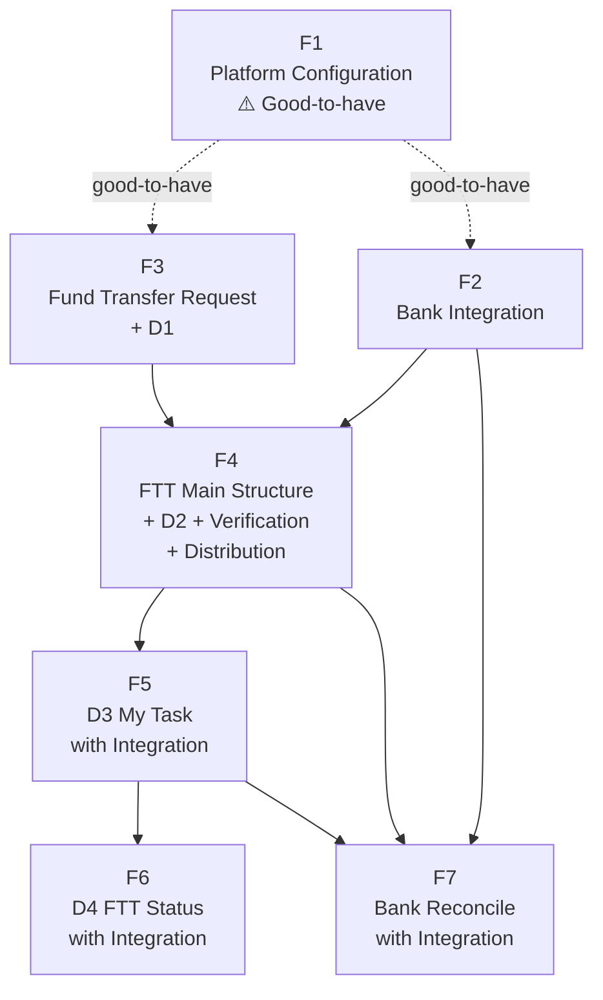

# Product Feature Backlog — H2H Fund Transfer System

> **Source:** [H2H_FundTransfer-ProductDocument.md](H2H_FundTransfer-ProductDocument.md)
> **Created:** 2026-03-04
> **Last Revised:** 2026-03-13 — Updated to v0.5. Bank Step 2 now has 3 outcomes (Success → TRANSFER_SUCCESS, Fail code 9999 → PENDING_BANK, Fail other → stays PENDING_SIGNER). Step 3 is optional, triggered only after code 9999, up to 3 polls. FTT state machine expanded from 5 → 7 states (added PENDING_BANK, TRANSFER_SUCCESS, TRANSFER_FAIL; removed BANK_SUBMITTED). Lending integration inverted: TP6 pre-submission removed; loan settlement now runs post-transfer at TP8 after TRANSFER_SUCCESS. All compensation logic removed. TRANSFER_FAIL is re-submittable or rejectable by Ops via D4. D4 now triggered by TRANSFER_FAIL state (not Step 3 Fail for BANK_SUBMITTED). Optional PENDING_BANK notification added (F5). Reconciliation updated: PENDING_BANK resolution; compensation notification removed (F7).
> **Purpose:** Product backlog for business stakeholders and development teams. Each **Feature** is a self-contained business capability described in full business context. Each **Task** lists what the business needs to happen — implementation approach is decided by the development team.

---

## Structure

```
Feature  (business capability — independently testable by business users)
├── Business Objective   what problem this solves and the value it delivers
├── Use Cases            happy path, unhappy path, edge cases
├── Business Acceptance  how business users test and sign off (UAT steps)
├── Dependencies         other Features this requires
├── Displays Used        which screens this Feature owns or contributes to
└── Tasks                numbered list — what the business needs; dev team decides how
```

---

## Feature Dependency Map



### Dependency Summary

| Feature | Depends On | Reason |
|---------|-----------|--------|
| F1 | — | Foundation config layer. Good-to-have — other features operate with seeded/default config if F1 is deferred. |
| F2 | F1 (optional) | Bank codes, proxy types, and partner settings come from config. Can operate with hardcoded defaults while F1 is pending. |
| F3 | F1 (optional) | Form fields, validation rules, document requirements driven by config. Can use default topic config while F1 is pending. |
| F4 | F2, F3 | Needs bank integration (account verify) and approved FTRs to operate. |
| F5 | F4 | D3 My Task acts on FTTs created and distributed in F4. Requires M4 integration rule execution (built in F5). |
| F6 | F4, F5 | D4 is triggered by the TRANSFER_FAIL state. FTT records (F4) and Bank Step Log are the source of truth. Bank Step 2/3 execution (F5) is the primary path to TRANSFER_FAIL; reconciliation (F7) is the secondary path. |
| F7 | F2, F4, F5 | Reconciles against bank records (F2), updates FTT records (F4), and resolves PENDING_BANK FTTs (built in F5). |

---

## Feature Index

| # | Feature | Business Capability | Priority |
|---|---------|-------------------|----------|
| F1 | [Platform Configuration](#f1) | Admin configures all business rules without code deployment | ⚠️ Good-to-have |
| F2 | [Bank Integration](#f2) | System communicates with the bank: account precheck, transfer submission, settlement monitoring | Must-have |
| F3 | [Fund Transfer Request + D1](#f3) | Maker creates a transfer request (manually or via API) and decides to approve or reject | Must-have |
| F4 | [FTT Main Structure + D2 + Verification + Distribution](#f4) | System creates and manages the transfer transaction lifecycle, runs background verification, and distributes tasks to Checker/Signer via D2 | Must-have |
| F5 | [D3 My Task with Integration](#f5) | Checker and Signer review assigned transactions on D3; Signer submits to bank (3 outcomes: TRANSFER_SUCCESS, PENDING_BANK, retry); post-transfer TP8 integration runs after TRANSFER_SUCCESS | Must-have |
| F6 | [D4 FTT Status with Integration](#f6) | System alerts all parties when FTT reaches TRANSFER_FAIL; Ops reviews Bank Step Log and Integration Step Log on D4 and takes final action (re-submit or reject) | Must-have |
| F7 | [Bank Reconcile with Integration](#f7) | Daily reconciliation matches bank records against system records; resolves PENDING_BANK FTTs to TRANSFER_SUCCESS or TRANSFER_FAIL | Must-have |

---

## Display Map (D1–D4)

| Display | Screen Name | Owned By | Primary Actors | Purpose |
|---------|-------------|---------|---------------|---------|
| D1 | Fund Transfer Request | F3 | Maker | Create, attach documents to, and decide on transfer requests |
| D2 | All Tasks — Worklist | F4 | Checker, Signer | View all pending transactions for the current review phase; search, filter, and book tasks |
| D3 | My Tasks — Review Panel | F5 | Checker, Signer | Review full transaction details, background checks, and step logs; take approval decisions; handle integration and bank submission failures |
| D4 | FTT Status / Transfer Failure Detail | F6 | Ops Manager, Maker, Checker, Signer | Review transfer failure details with full Bank Step Log and Integration Step Log (TP8 history); take final action (re-submit or reject) |

> **D2 and D3** serve both the Checker phase and Signer phase — the same screens are used for both roles; available actions differ based on FTT state.
>
> **F1, F2, and F7** have no direct user-facing screens. F1 is an admin configuration layer; F2 is a system-to-bank integration layer; F7 is a batch reconciliation process. Their results surface on D2, D3, and D4.

---

## Feature Details

---

<a id="f1"></a>
## F1: Platform Configuration

> **Priority: Good-to-have** — Other features can operate with seeded default configuration. F1 enables the system to be managed and extended by business administrators without code changes. Recommended for delivery before production go-live.

### Business Objective

Enable the System Administrator to configure all business rules — transfer topic types, data fields, approval chains, document requirements, duplicate detection rules, bank reference data, and file constraints — through an administration interface, without requiring code changes or a system deployment. All downstream features consume these configurations, making the system adaptable to new business requirements without engineering involvement.

### Use Cases

**Happy Path**
- Admin creates a new transfer topic (e.g., `PAYROLL`) with custom field labels, mandatory documents, and a two-step approval chain (Checker → Signer). Changes take effect immediately.
- Maker opens the transfer request form, selects the new topic, and sees the correct fields, labels, and validation rules.

**Unhappy Path**
- Admin submits a topic with a code that already exists → system rejects with a clear error; existing configuration unchanged.
- Admin configures a required field but leaves the label blank → save is blocked with a validation error.

**Edge Cases**
- Admin updates a field label while a transaction is already in progress → in-flight transactions retain the config snapshot from when they were created; new requests pick up the updated config.
- Admin configures zero duplicate-check rules for a topic → duplicate detection is effectively disabled for that topic.

### Business Acceptance (UAT)

> **Who conducts:** System Administrator + Business Analyst
> **Environment:** UAT environment with empty configuration tables

1. Admin creates transfer topic `TEST_TOPIC` with two required custom fields, one mandatory document type, and a two-step approval chain.
2. Maker logs in → opens the transfer request form → selects `TEST_TOPIC` → confirms the custom field labels appear and are required.
3. Admin updates one field label → Maker refreshes the form → confirms the updated label appears without a system restart or deployment.
4. Admin attempts to create a second topic with the same code → confirms an error is shown and no duplicate is created.
5. **Sign-off condition:** All four steps pass. No code deployment was required at any point.

### Dependencies

None — this is the foundation layer.

### Displays Used

None — F1 operates through an admin configuration interface outside D1–D4.

---

### Tasks

1. **Transfer Topic Management** — Admin can create and maintain transfer topic types (e.g., Payroll, Lending) that define the purpose and processing rules for each category of fund transfer. Each topic must have a unique code.

2. **Field and Label Configuration** — Admin can configure which data fields appear on a transfer request form for each topic, whether each field is required or optional, and the field labels used to match business terminology.

3. **Approval Chain Setup** — Admin can define the sequence of approval roles required for each transfer topic (e.g., Checker then Signer). This controls how many levels of review a request must pass through.

4. **Document Requirement Configuration** — Admin can specify which supporting document types are mandatory for each topic. A transfer request cannot be approved until all mandatory document types are attached.

5. **Duplicate Detection Rules** — Admin can configure rules per topic that the system uses to detect potentially duplicate or suspicious transfer requests. Up to 13 rules can be defined per topic.

6. **Bank and Proxy Reference Data** — Admin can maintain the list of bank codes, bank names, and payment proxy types (e.g., PromptPay mobile, PromptPay ID card) that the system supports.

7. **File Upload Constraints** — Admin can configure the allowed file types and maximum file size for supporting documents, per document category, to match business and compliance requirements.

---

<a id="f2"></a>
## F2: Bank Integration

### Business Objective

Provide a reliable, audited communication layer between the system and the partner bank (KBank). This covers: managing bank authentication, verifying destination accounts (both as a standalone precheck API for use by other flows such as the sales process, and as a background step within the fund transfer flow), submitting fund transfer instructions, and monitoring the bank for final settlement results. All significant bank communications are logged automatically for compliance.

> **Key design note:** The account verification capability is exposed as a **standalone precheck API** that any authorised internal system (e.g., the sales process) can call to validate a destination account before a fund transfer request is even created. This is separate from — but uses the same underlying bank call as — the background verification within the FTT flow.

### Use Cases

**Happy Path**
- *Precheck (sales process):* Sales system calls the Account Verification Precheck API with a destination account number → bank confirms account exists and returns account name → sales process displays result to agent.
- *FTT background check:* Worker verifies destination account as part of FTT background verification → bank confirms account exists and returns a verification reference (`rsTransID`) → account marked as verified.
- *Transfer submission — confirmed:* Signer approves → system submits transfer instruction to bank (Step 2) → bank returns Success → FTT moves to `TRANSFER_SUCCESS`.
- *Transfer submission — bank cannot confirm yet (code 9999):* Bank returns Fail with code 9999 → FTT moves to `PENDING_BANK` → system begins Step 3 settlement monitoring (up to 3 polls).
- *Settlement monitoring (Step 3):* Worker polls bank → bank confirms transfer completed (Success) → FTT moves to `TRANSFER_SUCCESS`.

**Unhappy Path**
- Destination account does not exist → precheck or background check returns Fail; caller receives a clear failure reason.
- Bank rejects the transfer instruction with a known failure code (Step 2 Fail, code ≠ 9999) → result recorded in Bank Step Log; FTT remains `PENDING_SIGNER`; Signer sees bank error reason on D3.
- Bank returns code 9999 on Step 2 → FTT moves to `PENDING_BANK`; Step 3 polling begins.
- Step 3 polling exhausts 3 retries with In Progress result → FTT stays `PENDING_BANK` until T+1 reconcile file resolves it.
- Step 3 returns Fail → FTT moves to `TRANSFER_FAIL`; D4 and failure alert triggered (F6).
- Authentication rate limit reached → system cannot obtain a new token; dependent operations wait until the window resets.

**Edge Cases**
- The verification reference (`rsTransID`) obtained during Checker review has expired by the time Signer approves → system automatically re-verifies the destination account (TP7) before submitting; Signer sees no change in flow and takes no extra action.
- Network timeout during account verification → verification marked as failed; manual retry available from D3.
- System attempts to submit the same transfer twice (retry logic) → idempotent submission; no duplicate bank transfer created.
- Step 3 polling exhausts 3 retries without a Success or Fail result → FTT stays `PENDING_BANK`; result is resolved the following day via reconciliation (F7).

### Business Acceptance (UAT)

> **Who conducts:** Technical team / QA — no direct business-facing UI; acceptance via observable system behaviour and audit records
> **Environment:** UAT environment connected to KBank sandbox

1. Call the Account Verification Precheck API with a known valid account → confirm account is verified, account name returned, result usable by the calling system.
2. Call the precheck API with an invalid account → confirm Fail result is returned clearly.
3. Trigger FTT background account verification for a valid account → confirm `is_account_verified=TRUE` and `rsTransID` stored.
4. Trigger a transfer submission (Step 2) with a Success response → confirm FTT moves to `TRANSFER_SUCCESS` and a bank audit log record is created.
5. Trigger a transfer submission (Step 2) with a Fail code 9999 response → confirm FTT moves to `PENDING_BANK` and Step 3 polling begins.
6. Trigger a transfer submission (Step 2) with a Fail response (code other than 9999) → confirm FTT stays `PENDING_SIGNER` and bank fail reason is visible on D3.
7. Confirm authentication token is reused within the valid window; a new token is obtained automatically on expiry.
8. Confirm settlement monitoring (Step 3) polling calls do NOT create audit log records.
9. **Sign-off condition:** All eight steps verified; audit log records match the agreed fields.

### Dependencies

- **F1** (optional) — bank codes, proxy types, and partner connection settings driven by config. Can operate with defaults while F1 is pending.

### Displays Used

None — F2 is a system-to-bank integration layer. Results surface on D2, D3, and D4 via F4, F5, and F6.

---

### Tasks

1. **Standalone Account Verification Precheck API** — The system exposes an API endpoint that any authorised internal system (e.g., sales process) can call to verify a destination bank account independently of the fund transfer flow. Returns account validity status, account name, and a verification reference. This enables upstream processes to confirm account eligibility before a fund transfer request is created.

2. **Bank Authentication Management** — The system manages authentication with the partner bank automatically, obtaining and caching access credentials and renewing them before expiry. Respects the bank's rate limits (max 5 token requests per 30-minute window).

3. **Destination Account Verification (FTT Background Check)** — The system verifies a destination account as part of the FTT background check (triggered at TP1 and TP4). Result and verification reference (`rsTransID`) are stored and made visible to reviewers on D2/D3.

4. **Verification Reference Freshness Check (TP7)** — When a transfer is about to be submitted, the system checks whether the stored `rsTransID` is still valid. If expired, the system automatically re-verifies the account and obtains a fresh reference before proceeding — no action required from the Signer.

5. **Fund Transfer Submission (Bank Step 2)** — The system sends the confirmed fund transfer instruction to the partner bank using the verified account reference. The bank's response has three outcomes: (1) Success → FTT moves to `TRANSFER_SUCCESS`; (2) Fail code 9999 (bank cannot confirm yet) → FTT moves to `PENDING_BANK`, Step 3 monitoring begins; (3) Fail other code → FTT remains `PENDING_SIGNER`, fail reason visible on D3. Result recorded in the Bank Step Log.

6. **Settlement Status Monitoring (Bank Step 3)** — Step 3 is optional and only triggered when Step 2 returns code 9999 (FTT in `PENDING_BANK`). The system polls the bank for the final settlement result at regular intervals, up to 3 times. Outcomes: Success → `TRANSFER_SUCCESS`; Fail → `TRANSFER_FAIL` (triggers F6 alert); In Progress after 3 polls → FTT stays `PENDING_BANK` and is resolved by T+1 reconciliation (F7). Step 3 poll results are NOT recorded in the Bank Step Log (high frequency, low audit value).

7. **Bank Communication Audit Log** — Every significant bank communication — authentication, account verification (precheck and FTT background), and transfer submission — is logged to the Bank Step Log for compliance and audit. Settlement monitoring polls are excluded (high frequency, low audit value).

---

<a id="f3"></a>
## F3: Fund Transfer Request + D1

### Business Objective

Provide two channels for initiating a fund transfer request: a UI-based flow where a Maker creates the request manually (single or batch) and makes an explicit approval decision; and an API-based flow where a trusted source system submits and auto-approves the request in a single call. In both channels, an approved request creates a transfer transaction that enters the downstream review and bank submission pipeline. A rejected request is closed permanently.

### Use Cases

**Happy Path**
- *Single:* Maker fills in the form for a transfer topic, attaches a mandatory document, reviews the request, and approves → transfer transaction created and enters the Checker queue.
- *Batch:* Maker uploads a file with 50 rows → all rows pass validation → 50 transfer requests created → Maker reviews summary → approves each → 50 transactions created.
- *API:* Source system sends an API request with auto-approve flag and valid credentials → system creates the request, approves it, and creates the transaction in one call.

**Unhappy Path**
- Maker submits the form with a missing required field → form cannot be submitted; field-level error shown.
- Maker tries to approve without attaching a mandatory document → approve action blocked with a clear message.
- Maker rejects a request without selecting a rejection reason → reject action blocked; reason is mandatory.
- Source system sends an API request with invalid credentials → request rejected; nothing created.

**Edge Cases**
- Batch file contains a mix of valid and invalid rows → valid rows create requests; invalid rows listed with row-level errors; remaining rows continue processing.
- Source system retries the same API call (network timeout) → second call detected as a duplicate and returns the existing request; no second record created.
- Maker uploads a file with allowed extension but mismatched content (e.g., executable disguised as PDF) → upload rejected based on file content, not extension.

### Business Acceptance (UAT)

> **Who conducts:** Maker role + Business Analyst
> **Environment:** UAT environment with F4 available to confirm transactions are created

1. Maker creates a single transfer request for `TEST_TOPIC`, fills all fields, attaches the required document, and approves → confirm transfer transaction appears in the system.
2. Maker attempts to submit the form with a required field empty → confirm form is blocked with an error.
3. Maker creates a request but does not attach the mandatory document, then tries to approve → confirm approve is blocked.
4. Maker uploads a batch file with 5 valid rows and 2 invalid rows → confirm 5 requests are created and 2 errors are shown with row detail.
5. Maker rejects a request → confirm it is permanently closed (no further actions available).
6. Technical team submits an API request with auto-approve → confirm the transfer transaction is created in one call.
7. **Sign-off condition:** All six steps pass.

### Dependencies

- **F1** (optional) — form fields, validation rules, document requirements, and topic codes are driven by configuration.

### Displays Used

**D1 — Fund Transfer Request**

Used by the Maker to create, attach documents to, and make a decision on transfer requests.

| Section on D1 | What Maker Sees | Available Actions |
|--------------|----------------|------------------|
| Create form | Transfer form with fields driven by the selected topic configuration | Create a single transfer request |
| Batch upload | File upload area; after processing shows a batch summary (success / failure count and row-level errors) | Upload a batch file to create multiple requests |
| Document panel | List of attached documents; mandatory document types highlighted per topic | Attach supporting documents |
| Review summary | Full request details, attached documents, and validation warnings | **Approve** (advances to transaction pipeline) / **Reject** (permanent, mandatory reason required) |

---

### Tasks

1. **Single Transfer Request via UI** — A Maker can create one transfer request at a time by filling in a form. The form adapts its fields and labels based on the selected transfer topic.

2. **Batch Transfer Request via File Upload** — A Maker can create many transfer requests in a single action by uploading a structured file. The system processes each row individually and provides a summary of which rows succeeded and which failed, with reasons for each failure.

3. **Supporting Document Attachment** — A Maker can attach supporting evidence documents to a transfer request. The system enforces the document types and file constraints configured for the topic. A request cannot be approved until all mandatory document types are present.

4. **Maker Approval or Rejection** — A Maker can review a transfer request and either approve it — which advances it into the downstream review pipeline — or reject it permanently with a mandatory reason.

5. **API-Based Auto-Submission** — A trusted external source system can submit a transfer request via API with automatic approval in the same call. This enables straight-through processing without requiring a Maker to manually act in the UI.

---

<a id="f4"></a>
## F4: FTT Main Structure + D2 + Verification + Distribution

### Business Objective

Create and manage the fund transfer transaction (FTT) lifecycle using a 7-state internal workflow. Immediately upon FTT creation, run parallel background verification — bank account check (via F2) and internal rule check (duplicate detection, cross-system rules) — and distribute the FTT to the appropriate Checker or Signer pool via the D2 worklist. Background checks gate Checker approval but do not block the task from appearing on D2.

### Use Cases

**Happy Path**
- FTR approved → FTT created (`CREATED`) → background checks triggered in parallel → FTT immediately distributed to D2 Checker pool → Checker sees FTT on D2 with check-in-progress indicators → checks complete and pass → `is_ready_to_check=TRUE` → Checker books and reviews on D3 (F5).
- Checker assigned → TP2 internal rule recheck runs → Checker approves → TP4 (account verify + internal rules recheck) → FTT distributed to Signer pool.
- Signer assigned → TP5 internal rule recheck → Signer reviews on D3 (F5).

**Unhappy Path**
- Account verification fails (invalid account) → `is_account_verified=FALSE` → `is_ready_to_check=FALSE` → FTT visible on D2 but Checker cannot approve → Checker sees ❌ indicator → retries from D3 (F5).
- Internal rule check detects a duplicate → `is_business_validated=FALSE` → Checker sees ⚠️ warning → Checker uses judgement to approve or reject.

**Edge Cases**
- Two Makers approve the same-content FTR simultaneously → `request_hash` (SHA256) duplicate protection blocks the second FTT from being created.
- Checker auto-assigned but all 2 slots are full → FTT remains in D2 pool; next available slot triggers assignment.
- FTT sat in D2 for 30 minutes before a Checker books it → TP2 re-triggers internal rule check on assignment, catching any new duplicates created in the interim.

### Business Acceptance (UAT)

> **Who conducts:** Checker role + Business Analyst
> **Environment:** UAT environment with F2 and F3 complete

1. Approve a transfer request (F3) → confirm FTT appears on D2 with check-in-progress indicators immediately (before checks complete).
2. Wait for background checks to complete and pass → confirm `is_ready_to_check` becomes TRUE and D2 indicator updates.
3. Checker books the FTT manually from D2 → confirm it appears on D3 (F5).
4. Checker is auto-assigned (system fills up to 2 slots) → confirm auto-assignment works and the task appears.
5. Trigger a duplicate transfer request (same content) → confirm only one FTT is created.
6. Trigger a transfer with an invalid destination account → confirm `is_account_verified=FALSE` and the Checker cannot approve from D3 until retried.
7. **Sign-off condition:** All six steps pass.

### Dependencies

- **F2** — bank account verification is called as part of background checks at TP1 and TP4.
- **F3** — FTTs are created from approved FTRs.

### Displays Used

**D2 — All Tasks (Worklist)**

Used by Checker and Signer to view all FTTs available for review in the current phase.

| Section on D2 | What User Sees | Available Actions |
|--------------|---------------|------------------|
| Task list | All FTTs in the current phase (Checker or Signer pool), with FTT summary (txn ID, amount, beneficiary, topic), background check progress indicators (✅/⏳/❌), and current FTT state | Search, filter by topic/state, manually book a task |
| Auto-assigned tab | FTTs automatically assigned to the current user (max 2) | Accept or return |
| Search | Search by contract number or beneficiary name | Locate specific FTTs |

---

### Tasks

1. **FTT Creation and 7-State Workflow Engine** — When a transfer request is approved (by Maker or auto-approved via API), the system creates a Fund Transfer Transaction (FTT) record. The FTT moves through 7 internal states: `CREATED` → `PENDING_CHECKER` → `PENDING_SIGNER` → [`TRANSFER_SUCCESS` | `PENDING_BANK` | `TRANSFER_FAIL`] → `REJECTED`. Bank Step 2 determines the post-submission path: Success → `TRANSFER_SUCCESS`; Fail code 9999 → `PENDING_BANK` (Step 3 then reconcile resolves to `TRANSFER_SUCCESS` or `TRANSFER_FAIL`); Fail other code → stays `PENDING_SIGNER`. State transitions are governed by role-based approval decisions and bank submission results.

2. **Background Account Verification (TP1 and TP4)** — The system automatically triggers a bank account verification (Step 1 via F2) when an FTT is created (TP1) and again after Checker approval (TP4). Result updates `is_account_verified`. Check runs asynchronously — FTT is already visible on D2 while the check runs.

3. **Internal Rule Check — Duplicate and Cross-System Validation (TP1, TP2, TP4, TP5)** — The system automatically triggers internal rule evaluation at key trigger points. Rules include: duplicate detection (configurable rules comparing reference data), suspicious transaction patterns, and cross-system rules that call other internal platforms for validation. Result updates `is_business_validated`. Runs asynchronously.

4. **Readiness Gate** — Checker cannot approve an FTT until both background checks pass: `is_ready_to_check = is_account_verified AND is_business_validated`. The gate is enforced at approval time. Check results and gate status are visible on D2 and D3 with clear indicators.

5. **Bank Step Log** — The system records every bank API call result (Step 1 Verify Account, Step 2 Fund Transfer Submit, Step 3 Inquiry Transfer Status) as an ordered log entry attached to the FTT. Captures: step name, result, bank response code, and timestamp. Multiple entries per step are supported (retries, polling). Stored in `fund_transfer_bank_step_log`.

6. **Integration Step Log** — The system maintains a separate ordered log per FTT for post-transfer integration steps (TP8 execution). Captures: action type (`POST_TRANSFER`), action name, result, detail, trigger reason, and timestamp. Stored in `fund_transfer_integration_step_log`. TP8 is triggered after `TRANSFER_SUCCESS` and runs asynchronously (e.g., Lending topic: Create Loan + Disburse).

7. **D2 All Tasks Worklist** — The D2 screen displays all FTTs in the current review phase (Checker pool or Signer pool) for the logged-in user. Each row shows the FTT summary, background check progress indicators, and current state. Checker and Signer each see only their own phase. Supports search by contract number and beneficiary name.

8. **Auto-Assignment and Manual Booking** — The system automatically assigns unbooked FTTs to available Checkers/Signers (up to 2 per user). Any user can manually book any unassigned FTT from D2 without a limit. Both routes move the FTT to D3 (F5) for review.

9. **Return to Pool** — An assigned user (Checker or Signer) can return an FTT from D3 back to D2, making it available for other users to book.

10. **Duplicate Transaction Protection** — The system generates a `request_hash` (SHA256) for each FTT. A partial unique index on active statuses prevents creation of a duplicate FTT from the same underlying request content.

11. **FTT Status Event Publication** — Every FTT state transition publishes an event to source systems via message broker. Events published: `ftt.created`, `ftt.pending_checker`, `ftt.pending_signer`, `ftt.pending_bank`, `ftt.transfer_success`, `ftt.transfer_fail`, `ftt.rejected`. TP8 integration results also trigger events after `TRANSFER_SUCCESS`.

---

<a id="f5"></a>
## F5: D3 My Task with Integration

### Business Objective

Provide a single review screen (D3) used by both Checker and Signer to examine assigned FTTs in full detail and take approval decisions. For Checker: review background check results and decide to approve, reject, retry, or return. For Signer: review the full picture and — upon approval — trigger bank submission (Step 2). Bank Step 2 has three outcomes: (1) Success → FTT moves to `TRANSFER_SUCCESS`; (2) Fail code 9999 → FTT moves to `PENDING_BANK`, Step 3 monitoring begins (up to 3 polls); (3) Fail other code → FTT remains `PENDING_SIGNER`, Signer sees bank error on D3. After `TRANSFER_SUCCESS`, the system automatically triggers post-transfer integration (TP8) in the background (e.g., Lending topic: Create Loan + Disburse).

### Use Cases

**Happy Path — Checker**
- Checker books FTT from D2 → reviews FTT details, background check results (✅), attached documents → all checks pass (`is_ready_to_check=TRUE`) → approves → FTT moves to `PENDING_SIGNER`.

**Happy Path — Signer (Step 2 Success)**
- Signer books FTT from D2 → reviews details → approves → TP7 ref key check → bank Step 2 submitted → bank returns **Success** → FTT moves to `TRANSFER_SUCCESS` → TP8 post-transfer integration triggers automatically in background (Lending topic: Create Loan + Disburse; non-Lending: skipped).

**Unhappy Path — Bank Step 2 Fail code 9999 (bank cannot confirm yet)**
- Signer approves → TP7 → bank Step 2 → bank returns **Fail code 9999** → FTT moves to `PENDING_BANK` → Step 3 monitoring begins (up to 3 polls) → Signer receives notification that FTT is PENDING_BANK (optional) → if Step 3 Success → `TRANSFER_SUCCESS` → TP8 triggered; if Step 3 Fail → `TRANSFER_FAIL` → D4 triggered (F6); if Step 3 still In Progress after 3 polls → FTT stays `PENDING_BANK` → T+1 reconcile resolves it (F7).

**Unhappy Path — Bank Step 2 Fail (code other than 9999)**
- Signer approves → TP7 → bank Step 2 → bank returns **Fail (code ≠ 9999)** → Bank Step Log updated (Fail) → FTT **remains** `PENDING_SIGNER` → D3 shows bank fail reason and error code prominently → Signer reviews → retries (re-runs bank Step 2) or rejects.

**Edge Cases**
- Checker retries a failed background check from D3 → check re-runs asynchronously → D3 result indicator updates when complete.
- Checker or Signer returns FTT to D2 → FTT available for another user to book.
- TP8 post-transfer integration runs asynchronously after `TRANSFER_SUCCESS` — Signer does not wait for TP8 to complete on D3. TP8 result is visible in the Integration Step Log on D3/D4.

### Business Acceptance (UAT)

> **Who conducts:** Checker and Signer roles + Business Analyst
> **Environment:** UAT environment with F4 complete; Lending topic configured

**Checker:**
1. Checker books an FTT from D2 → confirm FTT details, documents, and background check results are visible on D3.
2. Checker approves with all checks passed → confirm FTT moves to `PENDING_SIGNER`.
3. Checker tries to approve with `is_ready_to_check=FALSE` → confirm approve is blocked.
4. Checker retries a failed check → confirm it re-runs and updates the indicator on D3.

**Signer — Bank Step 2 outcomes:**

5. Signer approves → simulate bank Step 2 **Success** → confirm FTT moves to `TRANSFER_SUCCESS` → confirm Bank Step Log shows Step 2 Success entry.
6. Signer approves → simulate bank Step 2 **Fail code 9999** → confirm FTT moves to `PENDING_BANK` → confirm Step 3 polling begins → simulate Step 3 Success → confirm FTT moves to `TRANSFER_SUCCESS`.
7. Signer approves → simulate bank Step 2 **Fail (code ≠ 9999)** → confirm FTT stays `PENDING_SIGNER` → confirm D3 shows bank fail reason and error code.

**TP8 Post-Transfer Integration (Lending topic):**

8. Signer approves a Lending FTT → bank Step 2 Success → confirm FTT moves to `TRANSFER_SUCCESS` → confirm TP8 triggers asynchronously → Integration Step Log shows POST_TRANSFER/Success.

9. **Sign-off condition:** All eight steps pass.

### Dependencies

- **F4** — FTTs must be in `PENDING_CHECKER` or `PENDING_SIGNER` (distributed by F4) before D3 can act on them.
- **F2** — bank Step 2 (Fund Transfer Submit) and Step 3 (Settlement Monitoring) are executed via F2.

### Displays Used

**D3 — My Tasks (Review Panel)**

Shared screen used by both Checker and Signer. Same layout regardless of role — available actions differ based on FTT state and current user role.

| Section on D3 | Content | Available Actions |
|--------------|---------|------------------|
| FTT details | Txn ID, transfer topic, amount, source account, destination account, beneficiary name | — |
| Background checks panel | `is_account_verified` result (✅/⏳/❌) and `is_business_validated` result (✅/⏳/❌) with detail | Retry failed or incomplete checks |
| Attached documents | Documents from the original FTR | View / download |
| Bank Step Log | Full history of bank API call results for this FTT (Step 1, Step 2, Step 3) | — |
| Integration Step Log | Full history of TP8 post-transfer integration steps for this FTT (POST_TRANSFER action type) | — |
| Bank Step 2 fail detail panel | Shown when most recent bank Step 2 = Fail (code ≠ 9999) — displays bank error code and reason | — |
| PENDING_BANK status panel | Shown when FTT = `PENDING_BANK` — informs Signer that Step 3 monitoring is in progress | — |
| Checker actions | Available when FTT in `PENDING_CHECKER` and assigned to user | **Approve** (requires `is_ready_to_check=TRUE`), **Reject** (mandatory reason), **Retry checks**, **Return to D2** |
| Signer actions | Available when FTT in `PENDING_SIGNER` and assigned to user | **Approve** (triggers TP7 then bank Step 2), **Reject** (mandatory reason), **Retry checks**, **Return to D2** |
| Signer actions — Step 2 fail state | Shown when bank Step 2 most recently returned Fail (code ≠ 9999). **Signer must review the fail reason before retry is enabled.** | **Retry** (re-run bank Step 2), **Reject** |

---

### Tasks

1. **D3 Shared Review Panel** — A single screen displays the full FTT detail for both Checker and Signer. Content includes: FTT details, background check results, attached documents, Bank Step Log, and Integration Step Log (TP8 history). The same layout is used for both roles; available actions are determined by FTT state and assigned user role.

2. **Checker Review and Approval** — Checker can review FTT details and background check results on D3. When all checks pass (`is_ready_to_check=TRUE`), Checker can approve (→ `PENDING_SIGNER`), reject with mandatory reason (→ `REJECTED`), retry failed checks, or return to D2.

3. **Background Check Retry** — Checker or Signer can manually retry a failed or incomplete background check (account verification or internal rule check) from D3. Result updates asynchronously with visual indicator.

4. **Signer Review and Approval** — Signer can review the full FTT including Checker's approval history. Signer can approve (triggers the submission sequence below), reject with mandatory reason, retry checks, or return to D2.

5. **Bank Step 2 Submission (3 Outcomes)** — After Signer approves, system executes TP7 (ref key freshness check) then submits the fund transfer to the bank (bank Step 2 via F2). Result is recorded in the Bank Step Log. Three outcomes: (1) **Success** → FTT moves to `TRANSFER_SUCCESS`; (2) **Fail code 9999** (bank cannot confirm yet) → FTT moves to `PENDING_BANK`, Step 3 monitoring begins; (3) **Fail other code** → FTT remains `PENDING_SIGNER`, fail reason displayed on D3.

6. **Bank Step 2 Fail Handling (code ≠ 9999)** — When bank Step 2 returns Fail with any code other than 9999, the bank error code and fail reason are displayed prominently on D3. Retry action is blocked until Signer acknowledges the fail reason. Signer can retry (re-runs bank Step 2 from scratch) or reject the FTT. FTT remains `PENDING_SIGNER` throughout.

7. **PENDING_BANK Notification and Step 3 Monitoring** — When bank Step 2 returns code 9999, FTT transitions to `PENDING_BANK`. An optional in-app notification is sent to the Signer informing them that the FTT is awaiting bank confirmation. Step 3 settlement monitoring runs up to 3 polls: Success → `TRANSFER_SUCCESS`; Fail → `TRANSFER_FAIL` (F6 triggered); In Progress after 3 polls → FTT stays `PENDING_BANK` and awaits T+1 reconcile (F7).

8. **TP8 Post-Transfer Integration** — After FTT moves to `TRANSFER_SUCCESS`, the system automatically triggers the topic's post-transfer integration rule (TP8) asynchronously. For the Lending topic: calls Core Banking to Create Loan + Disburse Principal. Result is recorded in the Integration Step Log (action type: `POST_TRANSFER`). TP8 is skipped for topics without a post-transfer rule. Signer does not wait for TP8 to complete — D3 shows the integration result when available.

9. **Integration Step Log and Bank Step Log Display** — D3 displays the full Integration Step Log (TP8 POST_TRANSFER history) and Bank Step Log for the FTT, giving Signer and Checker complete visibility of all bank call results and post-transfer integration outcomes for the current transaction.

---

<a id="f6"></a>
## F6: D4 FTT Status with Integration

### Business Objective

When an FTT reaches the `TRANSFER_FAIL` state — whether from bank Step 3 returning Fail or from the T+1 reconciliation file — the system must immediately alert all associated parties and surface the D4 screen for Ops to review the full Bank Step Log and Integration Step Log (TP8 history) before taking final action: re-submit (returns FTT to `PENDING_CHECKER`) or reject permanently.

### Use Cases

**Happy Path (for failure resolution)**
- FTT transitions to `TRANSFER_FAIL` (from Step 3 Fail or reconciliation) → in-app notification sent to all associated users → Ops opens D4 → reviews bank result code, full Bank Step Log, and Integration Step Log (TP8 history) → decides to re-submit (returns FTT to `PENDING_CHECKER`) or reject (→ `REJECTED`).

**Unhappy Path**
- Ops tries to access D4 for an FTT that is not in `TRANSFER_FAIL` → D4 is not available; FTT is visible only via history/search.

**Edge Cases**
- Ops receives notification but is currently reviewing a different FTT on D3 → notification appears as a toast on D3 without interrupting current work → Ops can click through to D4 when ready.
- Re-submit triggers a full restart: FTT returns to `PENDING_CHECKER` → approval pipeline repeats → next Signer approval re-runs bank submission from scratch (TP8 re-runs after TRANSFER_SUCCESS).

### Business Acceptance (UAT)

> **Who conducts:** Ops Manager role + Business Analyst + technical team (to simulate Step 3 Fail)
> **Environment:** UAT environment with F4 and F5 complete

1. Simulate bank Step 3 Fail → confirm FTT moves to `TRANSFER_FAIL` and Bank Step Log shows Step 3 Fail entry.
2. Confirm in-app notification is received by all associated users (Maker, Checker, Signer, Ops Manager) — notification shows txn ID, amount, beneficiary, and bank fail reason.
3. Ops navigates to D4 → confirm full Bank Step Log, Integration Step Log (TP8 history), FTT details, and attached documents are displayed.
4. Ops rejects from D4 → confirm FTT moves to `REJECTED`.
5. Ops re-submits from D4 → confirm FTT returns to `PENDING_CHECKER` → verify approval pipeline restarts correctly.
6. **Sign-off condition:** All five steps pass.

### Dependencies

- **F4** — FTT record, Bank Step Log, and Integration Step Log are managed by F4. The `TRANSFER_FAIL` state (from Step 3 or reconcile) is the trigger for D4.
- **F5** — bank Step 3 Fail (primary path to `TRANSFER_FAIL`) occurs after the Signer submission flow in F5.

### Displays Used

**D4 — FTT Status / Transfer Failure Detail**

Displayed to Ops Manager and all users associated with the FTT when FTT moves to `TRANSFER_FAIL`.

| Section on D4 | Content | Available Actions |
|--------------|---------|------------------|
| FTT summary | Txn ID, topic, amount, source account, destination account, beneficiary | — |
| Transfer failure detail | Bank failure result code and description (from Step 3 Fail or reconcile finding) | — |
| Bank Step Log | Full ordered log of all bank API calls (Step 1, 2, 3) with results and timestamps | — |
| Integration Step Log | Full ordered log of all TP8 POST_TRANSFER integration steps with results and timestamps | — |
| FTT history | Full approval trail: created by, Checker who approved, Signer who approved, all timestamps and state changes | — |
| Attached documents | Documents from the original FTR | View / download |
| Resolution actions | — | **Re-submit** (returns to `PENDING_CHECKER`), **Reject** (final, mandatory reason → `REJECTED`) |

---

### Tasks

1. **TRANSFER_FAIL Detection and D4 Trigger** — When an FTT transitions to `TRANSFER_FAIL` — either because bank Step 3 returns Fail (via F5 monitoring) or because the T+1 reconciliation file confirms failure (via F7) — the system marks the FTT as requiring Ops action. D4 becomes accessible to associated users for that FTT.

2. **In-App Failure Notification** — System pushes a real-time banner/toast notification to all users associated with the failed FTT (Maker who created the FTR, Checker who approved, Signer who approved, configured Ops Managers). The notification appears on whichever of D1/D2/D3/D4 the user is currently viewing. Content: txn ID, amount, beneficiary name, bank failure reason, and a deep-link to D4.

3. **D4 Transfer Failure Detail Screen** — The D4 screen displays full context for the failed FTT: transfer failure result code and description, complete Bank Step Log, complete Integration Step Log (TP8 POST_TRANSFER history), full FTT approval history, FTT transfer details, and attached documents. All information is read-only.

4. **Reject Action on D4** — Ops Manager can reject the FTT from D4 with a mandatory reason. Status moves to `REJECTED`. Event published to source system. This is a terminal action — no rework.

5. **Re-Submit Action on D4** — Ops Manager can re-submit the FTT from D4. System tags the FTT with the bank failure reason, re-triggers background checks, and returns the FTT to `PENDING_CHECKER`. The approval pipeline restarts from the beginning. Next Signer approval re-runs bank submission; TP8 re-runs after the new `TRANSFER_SUCCESS`.

---

<a id="f7"></a>
## F7: Bank Reconcile with Integration

### Business Objective

Run a daily automated comparison between the system's fund transfer records and the bank's settlement file to detect mismatches, ensure financial accuracy, and satisfy audit requirements. When reconciliation identifies a transfer outcome for an FTT in `PENDING_BANK` — particularly one where real-time Step 3 polling was inconclusive — the system updates the FTT state: confirmed success → `TRANSFER_SUCCESS` (then TP8 triggers); confirmed failure → `TRANSFER_FAIL` (then D4 and alert trigger). Amount or status mismatches are flagged for Ops investigation.

### Use Cases

**Happy Path**
- KBank uploads settlement CSV to S3 overnight → batch job runs at 07:00 AM → all 200 records match system records → report shows 200 MATCHED → no FTT updates needed → report sent via email and Google Chat.
- Reconciliation finds an FTT in `PENDING_BANK` (Step 3 was inconclusive) → bank file confirms transfer success → FTT updated to `TRANSFER_SUCCESS` → TP8 post-transfer integration triggered.

**Unhappy Path**
- Reconciliation finds an FTT in `PENDING_BANK`, but bank settlement file shows transfer failed → FTT moves to `TRANSFER_FAIL` → TRANSFER_FAIL alert and D4 triggered (F6) → MISMATCHED record logged with reason.
- Reconciliation finds an amount mismatch (system shows THB 50,000; bank shows THB 55,000) → MISMATCHED record logged → Ops investigates source system.
- KBank CSV contains a `rsTransID` not found in system → UNMATCHED → could indicate manual transfer at bank → escalated for investigation.

**Edge Cases**
- CSV file has a corrupted row → file moved to `failed/` folder → notification sent with error detail → KBank re-sends.
- The FTT was already `REJECTED` by Ops from D4 before reconciliation runs → reconciliation records the match/mismatch for audit but no further action is taken on the FTT.

### Business Acceptance (UAT)

> **Who conducts:** Ops Manager + Business Analyst + technical team (to provide sample CSV)
> **Environment:** UAT environment with F4, F5, F6 complete; S3 bucket configured

1. Upload a sample CSV where all records match system records → confirm report shows all MATCHED; no FTT updates; report delivered via email and Google Chat.
2. Upload a CSV where one record confirms a successful transfer for an FTT in `PENDING_BANK` → confirm FTT moves to `TRANSFER_SUCCESS` → confirm TP8 post-transfer integration triggers (Lending topic: Create Loan + Disburse) → confirm Integration Step Log updated.
3. Upload a CSV where one record shows a failed transfer for an FTT in `PENDING_BANK` → confirm FTT moves to `TRANSFER_FAIL` → confirm TRANSFER_FAIL alert and D4 trigger → confirm MISMATCHED is recorded with reason.
4. Upload a CSV with an `rsTransID` not in the system → confirm UNMATCHED recorded → confirm notification includes the unmatched record detail.
5. Upload a CSV with a corrupted row → confirm file moved to `failed/` folder → confirm notification sent.
6. **Sign-off condition:** All five steps pass.

### Dependencies

- **F2** — reconciliation compares against bank records; bank integration layer provides the `rsTransID` reference.
- **F4** — FTT records (including `PENDING_BANK` state) are updated by reconciliation findings; Bank Step Log and Integration Step Log are read for context.
- **F5** — TP8 post-transfer integration (built in F5) is triggered by reconciliation when a `PENDING_BANK` FTT is resolved to `TRANSFER_SUCCESS`.

### Displays Used

None — F7 is a fully automated batch process. Reconciliation reports are delivered via email and Google Chat. Discrepancy findings that relate to in-progress FTTs surface when those FTTs are viewed on D3 or D4.

---

### Tasks

1. **Daily CSV Ingestion** — Batch job runs at 07:00 AM daily, downloading the settlement CSV file that KBank uploads to S3 between 03:00–06:00 AM. The file is pipe-delimited. The job processes all records before sending a report.

2. **Three-Way Match Classification** — For each record in the CSV, the system classifies the result as: MATCHED (found in system + all data agrees), MISMATCHED (found in system + data differs — e.g., amount, status), or UNMATCHED (not found in system — unexpected record from bank). Mismatch reason is recorded for each MISMATCHED entry.

3. **Batch Summary and Detail Logging** — For each processed file, the system records a batch-level summary (total, matched, mismatched, unmatched counts) and a detail record for every row (especially mismatches and unmatched). Stored in `kbank_reconcile_batch` and `kbank_reconcile_detail`.

4. **FTT State Resolution from Reconciliation** — When reconciliation identifies a record that corresponds to an FTT in `PENDING_BANK`, the system resolves the FTT state based on the bank's settlement result: confirmed success → FTT moves to `TRANSFER_SUCCESS` (TP8 post-transfer integration triggered); confirmed failure → FTT moves to `TRANSFER_FAIL` (D4 alert triggered, F6). For MISMATCHED records with amount or other data differences, the discrepancy detail is recorded and flagged for Ops without changing FTT state.

5. **Reconciliation Report Notification** — After each reconciliation run, the system sends a summary report via Email and Google Chat. The report highlights mismatched and unmatched records with relevant detail. Sent regardless of whether all records matched (confirmation that reconciliation ran is itself useful).

6. **File Management** — After processing, the system moves successfully processed files to the `processed/` folder on S3. Files that fail to parse are moved to the `failed/` folder. Failed files trigger a notification with the error detail so KBank can re-send or the team can manually correct.

---

> **Next Step:** User review. Please confirm scope, flag any corrections, and raise any open questions before development planning begins.
